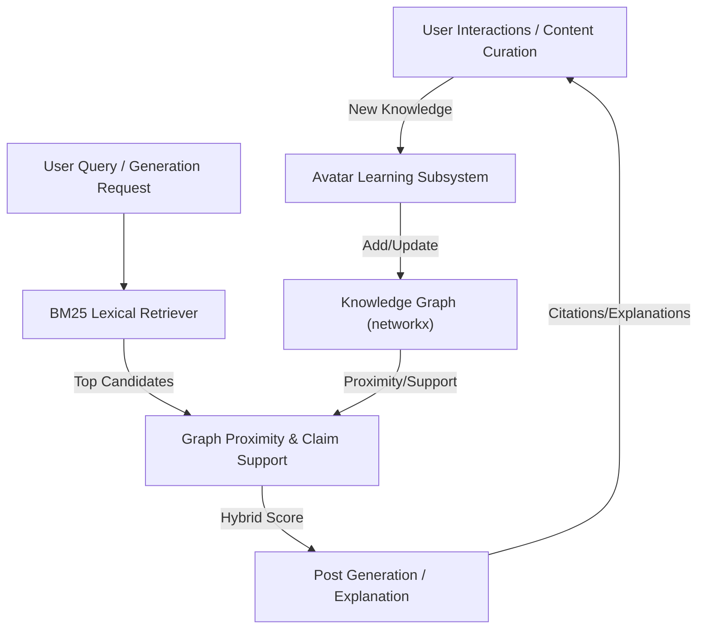

# LinkedIn SSI Booster

#### _<u> — Persona-Grounded Truth-Gated Adaptive-Continual-Learning Hybrid-RAG Agent with Domain-Knowledge-Graph</u>_

[](LICENSE)[]()

**LinkedIn SSI Booster** isn't just a prompt wrapper — it's an adaptive continual learning automation system for content, curation, and persona growth. It combines spaCy-based NLP, a persona graph, BM25 retrieval, a truth gate, confidence scoring, a NetworkX-powered knowledge graph, and local memory to generate, curate, rank, and route posts with more control and explainability than a basic AI writer workflow.

## 🧠 Intelligence Stack — Why This Is Smarter Than Just 'AI Writes Posts'

- **Advanced NLP with spaCy** — Theme/claim extraction, semantic similarity, sentiment/tone analysis, and two advanced curation/grounding features:
  
  - **Fact Suggestion:** When the truth gate drops a sentence, spaCy suggests the closest matching fact or evidence from your persona graph, or recommends how to rephrase for grounding.
  - **Contextual Summarization:** spaCy generates concise, context-aware summaries of curated articles, improving the quality of commentary and learning signals.

- **Persona-grounded generation** — Every post is written in your real technical voice, with facts, projects, and outcomes pulled from your private persona graph and knowledge graph (not just keywords or a bio blurb).

- **Hybrid RAG + agent pipeline** — Combines BM25 retrieval, deterministic validation, multi-step agent orchestration, and a hybrid BM25+graph reranker for high factuality, persona-awareness, and variety.

- **Curation learning loop** — The system tracks every generated candidate, learns which ones you actually publish, and automatically floats the best sources/topics to the top in future runs (Beta-smoothed acceptance priors per source/SSI component).

- **Truth gate** — Post-generation filter removes unsupported claims (numbers, dates, company names, project-tech mismatches) for maximum credibility. Four validation layers run in sequence on every sentence:
  
  - **BM25 evidence scoring** — each sentence is ranked against article text and persona facts; sentences below the configurable threshold (`TRUTH_GATE_BM25_THRESHOLD`) are flagged as weakly supported.
  - **Derivative of Truth per-sentence scoring** — every sentence receives a composite truth gradient (evidence type × reasoning quality × source credibility × token overlap). Sentences that pass BM25 but score below `TRUTH_GRADIENT_FLAG_THRESHOLD` (0.35) are flagged `weak_dot_gradient` and auto-removed. The 4-term DoT formula is active — token overlap between the sentence and each evidence fact is computed (Jaccard) and included as a 25%-weight component.
  - **spaCy semantic similarity floor** — for sentences containing numeric claims, years, dollar amounts, or org names, `compute_similarity()` checks the sentence against the source article. Similarity below `TRUTH_GATE_SPACY_SIM_FLOOR` (default `0.10`, configurable) flags the sentence as `low_semantic_similarity`, catching paraphrased hallucinations BM25 misses.
  - **spaCy NER org-name validation** — org/company names are extracted via spaCy named entity recognition (`ORG` entities) and verified against the allowed evidence set. Falls back to the legacy regex when spaCy is unavailable.
  - **False-positive hardening for tech terms** — concept/service tokens and tech-version entities (for example `S3`, `AI Q&A`, `Java 21`) are filtered before ORG enforcement so technical references are not incorrectly blocked as `unsupported_org`.
  - **Expanded domain evidence via multi-file loading** — avatar state now auto-merges sibling `domain_knowledge_*.json` files (for example Java and Python packs), which broadens allowed evidence tokens and improves support checks.
  - **Fact-pool spaCy similarity (Part E)** — for every sentence that passes BM25, the best spaCy cosine similarity across all persona/domain facts (individually) is computed. Sentences below `TRUTH_GATE_FACT_SIM_FLOOR` (default `0.05`) are flagged `low_fact_similarity`. Unlike the article-sim check, this runs in **all contexts including console mode** because persona/domain facts are always present.
  
  > See [docs/derivative-of-truth.md](docs/derivative-of-truth.md) for the full layer-by-layer breakdown, the DoT vs spaCy sim comparison table, all env var thresholds, and the mathematical framework.

- **Confidence scoring & policy routing** — Each post is scored for grounding, novelty, and repetition; you control what gets scheduled, sent to Ideas, or blocked entirely.

- **Memory & repetition penalty** — The system remembers recent themes and claims, penalizing repeated angles so your feed stays fresh.

- **Explainability & learning reports** — CLI flags let you see exactly which facts grounded each post, trace graph-based support, and generate advisory reports from moderation history.

- **Derivative of Truth (DoT) reporting** — Use `--dot-report` with either `--schedule` or `--curate` to print a detailed truth gradient, evidence, and uncertainty breakdown for every generated post or curated idea.

- **No cloud AI keys required** — All generation is local (Ollama), with persona and learning data stored only on your machine.

**Result:** You get a self-improving, persona-driven content engine that adapts to your taste, avoids repetition, and systematically grows your SSI — with full transparency, control, and explainability.

---

### 🏆 What is the LinkedIn SSI?

The [LinkedIn Social Selling Index](https://www.linkedin.com/sales/ssi) is a 0–100 score LinkedIn updates daily. It measures how effectively you build your personal brand, find the right people, engage with insights, and build relationships — the four pillars LinkedIn's algorithm uses to determine how widely your content and profile are surfaced to others.

A higher SSI directly correlates with more profile views, post reach, and inbound connection requests. LinkedIn's own data shows that professionals with an SSI above 70 get 45% more opportunities than those below 30.

The score breaks down into four components (25 points each):

| Component                             | What LinkedIn measures                                                            |
| ------------------------------------- | --------------------------------------------------------------------------------- |
| **Establish your professional brand** | Completeness of profile, consistency of posting, saves/shares on your content     |
| **Find the right people**             | Profile searches landing on you, connection acceptance rate, right-audience reach |
| **Engage with insights**              | Shares, comments, and reactions on industry content; thought leadership signals   |
| **Build relationships**               | Connection growth, message response rate, relationship depth                      |

### 🤖 Why automate it?

SSI decays if you go quiet — LinkedIn penalises inconsistency. Manually writing 3 posts per week, curating industry articles with original commentary, and maintaining an on-brand voice across hundreds of posts is simply not sustainable alongside a full-time engineering role.

This tool handles the repeatable parts:

- **Consistent cadence** — 3 posts/week scheduled to Buffer at proven engagement times (Tue/Wed/Fri 4 PM EST)
- **On-brand content** — every post is grounded in your real projects, real numbers, and real technical voice via a detailed persona prompt
- **All four SSI pillars** — the content calendar and curator rotate across all four components so no single pillar is neglected
- **Curation pipeline** — fetches today's AI/GovTech news, filters by your niche, and generates commentary that you can either:
  - push to Buffer Ideas for review and manual approval (default), or
  - schedule directly as posts to your Buffer queue (using `--type post`)

**Advanced Reporting CLI Flags:**

- `--dot-report` — Show a Derivative of Truth (truth gradient, evidence, uncertainty) report for every generated post (with `--schedule`) or curated idea (with `--curate`).

- `--avatar-explain` — Show evidence IDs and grounding summary after each generation.

- `--avatar-learn-report` — Print learning report from captured moderation events and exit.

- `--learn` — Extract and persist knowledge from curated articles into `extracted_knowledge.json`. Three modes:
  
  - **Fast learn-only** (`--curate --learn`, no `--dry-run`) — fetches all RSS articles and runs knowledge extraction on each one, skipping generation, confidence scoring, and Buffer entirely. No sleep delays between articles. Use this to bulk-load the knowledge base as fast as possible.
  - **Preview + learn** (`--curate --learn --dry-run`) — extracts knowledge AND generates posts in dry-run mode (nothing pushed to Buffer). Shows what would be generated.
  - **Live + learn** (`--curate --learn` with an earlier run that already had `--dry-run` removed) — generates and pushes posts to Buffer while also extracting knowledge from each article.
  
  When `--learn` is active, the normal 5-post cap is bypassed — every relevant article found across all feeds is processed (e.g. 60+ articles in one pass).

You control whether curated content is reviewed before publishing or scheduled directly. The tool removes the blank-page problem, but you decide what goes live.

---

## 🚀 Schedule Your Content with Buffer (Partner Link)

Want to automate your LinkedIn growth with the best scheduling tool? [Sign up for Buffer with our partner link](https://join.buffer.com/samjd42) and get started in minutes!

**Why Buffer?**

- Effortlessly schedule posts at optimal times for maximum reach
- Manage multiple channels and queues from one dashboard
- Integrates seamlessly with LinkedIn SSI Booster for hands-off publishing

**Support the project:** Using our [Buffer partner link](https://join.buffer.com/samjd42) helps fund ongoing development and keeps this tool open-source. Try Buffer today and see why top creators and engineers trust it for their content workflow!

---

## 🔍 Learning, Grounding, and Explainability Pipeline

**How the system learns and adapts:**

- **Candidate logging:** Every generated post and curated article candidate is logged, including source, topic, and all relevant metadata. This creates a full audit trail of what the system considered, not just what was published.
- **Reconciliation & learning:** When you publish or reject posts (via Buffer or moderation), the system reconciles what actually went live. It updates acceptance rates (priors) for each source, topic, and SSI component, so future curation floats the best-performing sources and topics to the top.
- **Ranking:** Article and post candidates are ranked using a combination of acceptance priors and BM25 retrieval scores, so the system learns your preferences over time and adapts what it suggests.
- **Signal flow — truth gate → confidence → selection learning:** Truth gate removal rates and reason codes feed directly into the confidence scorer. The confidence score routes each post to `post` (scheduled directly), `idea` (Buffer Ideas for manual review), or `block`. Those publication outcomes are later reconciled against Buffer — posts that actually go live raise the acceptance prior for their source, topic, and SSI component; posts that stay as ideas or get blocked do not count. Over time, sources that reliably produce clean, well-grounded posts float to the top of article ranking, while sources that consistently trigger heavy truth-gate filtering sink. The truth gate doesn't pre-filter articles — it filters the generated output — but its signal is what teaches the selection layer which articles are worth fetching next run.

**How deterministic grounding and the truth gate work:**

- **Fact retrieval:** For every post or answer, the system retrieves relevant facts from your persona graph (projects, skills, outcomes) using BM25Okapi — a production-grade IR algorithm. This ensures rare, high-signal skills and projects are prioritized.
- **Prompt balance rules:** Prompts require every factual claim to be grounded in either the article or your persona facts. Personal references are capped, and invented stats/dates/companies are forbidden.
- **Truth gate:** After generation, a four-layer deterministic filter removes any sentence with unsupported numbers, dates, company names, or project-tech mismatches unless the claim is found in evidence. The layers are: BM25 evidence scoring → per-sentence Derivative of Truth gradient (4-term formula with token overlap) → spaCy semantic similarity floor for specific-claim sentences → spaCy NER org-name validation. ORG validation includes hardening against common technical false positives (for example `S3`, `AI Q&A`, `Java 21`) and is backed by an expanded evidence set from auto-merged `domain_knowledge_*.json` files. Each removed sentence is logged with a reason code (`weak_evidence_bm25`, `weak_dot_gradient`, `low_semantic_similarity`, `unsupported_org`, etc.) that feeds the confidence scoring pipeline.

---

## 🧮 Derivative of Truth (DoT) - PLN (Probabilistic Logic Networks) Reasoning

The SSI Booster now features a full Probabilistic Logic Networks (PLN) inference engine, bringing advanced reasoning and explainability to every truth gradient calculation. With PLN, the system doesn't just check if a claim is supported — it can now model deduction, induction, abduction, and revision, dynamically weighing evidence and tracking the evolution of truth over time.

**What does this mean for you?**

- **Smarter, more nuanced truth scoring:** Each post and fact is evaluated using PLN's formal logic, not just keyword overlap or simple heuristics.
- **Dynamic evidence weighting:** The system adapts how much weight to give each piece of evidence or reasoning step, based on context and confidence.
- **Truth trajectory tracking:** See how the credibility of a claim changes as new evidence arrives, with dT/dt (rate of truth change) calculations.
- **Dual-mode scoring:** Instantly compare PLN-based and legacy scoring for transparency and debugging.
- **Richer DoT reports:** Every Derivative of Truth report now includes PLN metadata, so you can trace exactly how a claim was supported, revised, or rejected.
- **PLN is on by default:** All new posts, curation, and learning runs use PLN reasoning automatically — no config required.

Want to see the math and logic? Check out the new [docs/dot-pln-enhancement.md](docs/dot-pln-enhancement.md) and the PLN diagram in `media/pln-dot.png`.

This upgrade makes the SSI Booster's grounding and explainability pipeline even more robust, transparent, and future-proof. 

Every generated sentence receives a composite truth gradient score (evidence quality × reasoning strength × source credibility × claim-evidence token overlap). Sentences below `TRUTH_GRADIENT_FLAG_THRESHOLD` (default 0.35) are flagged `weak_dot_gradient` and removed before publication. DoT runs as Part B of the five-layer truth gate, after BM25 and before spaCy semantic checks.

See [docs/derivative-of-truth.md](docs/derivative-of-truth.md) for the full framework: mathematical model, pipeline diagrams, all five truth gate layers, env var reference, and how DoT improves over time.

---

## 🧩 Knowledge Graph Choice: NetworkX Core, Neo4j for Expansion

The core knowledge graph is implemented with NetworkX, an in-memory Python graph library. This choice is intentional:

- **Simplicity & Speed:** NetworkX is fast, pure Python, and ideal for small to medium graphs (well under 100k nodes/edges), which covers all core persona, domain, and learning knowledge for a single avatar.
- **Tight, Local Core:** By keeping the avatar's core knowledge graph tight and local, the system remains fast, debuggable, and easy to extend—no external dependencies or infrastructure required.
- **Scalability Policy:** If the knowledge graph ever needs to scale to millions of nodes/edges (e.g., for mass knowledge injection, multi-avatar, or enterprise use), the system is designed to support Neo4j as a drop-in backend. Neo4j provides persistent, disk-backed storage and a powerful query language (Cypher) for large-scale or multi-user scenarios.
- **Best of Both Worlds:** For most users, NetworkX is more than sufficient. Neo4j is reserved for future expansion, bulk import, or advanced analytics—keeping the core avatar experience lightweight and local-first.

**Current graph size:** The combined domain and learning knowledge graphs are well below 1,000 nodes—orders of magnitude under any practical NetworkX limit.

See the chart below for a summary of trade-offs:

| Feature/Constraint    | NetworkX (Current)                               | Neo4j (Future Option)                         |
| --------------------- | ------------------------------------------------ | --------------------------------------------- |
| Storage               | In-memory (RAM only)                             | On-disk, persistent                           |
| Scale                 | Best for small/medium graphs (<100k nodes/edges) | Scales to millions/billions of nodes/edges    |
| Query Language        | Python API, no query language                    | Cypher query language                         |
| Performance           | Fast for small graphs, slows with size           | Optimized for large, complex queries          |
| Persistence           | No built-in persistence                          | Full persistence, ACID compliance             |
| Integration           | Simple, pure Python                              | Requires running Neo4j server, extra setup    |
| Learning/Dev Overhead | Minimal, easy to use                             | Higher, requires Cypher and DB management     |
| Use Case Fit          | Prototyping, research, local automation          | Production, multi-user, large-scale analytics |
| Cost                  | Free, no infra                                   | Free (Community), but infra/ops required      |

**Bottom line:** The core of the avatar will remain in NetworkX for speed, simplicity, and local-first operation. Neo4j is available for future expansion, mass knowledge injection, or advanced analytics if needed.

---

The system now includes a NetworkX-powered knowledge graph for incremental learning, hybrid BM25+graph retrieval, and persona-aware reranking.

**Integration Philosophy:**

- BM25 (lexical retrieval) remains the primary candidate selector for claims, project details, facts, narrative memory, and learned article summaries.

- The NetworkX knowledge graph is used as a secondary, persona-aware reranker and explainer: it links persona ↔ skills ↔ projects ↔ claims ↔ domain facts.

- Final candidate scoring is a hybrid:
  
  $$
  ext{final} = 0.7 \times \text{bm25} + 0.2 \times \text{graph proximity} + 0.1 \times \text{claim support}
  $$

### 🧬 Hybrid Retrieval and Scoring Architecture



## 🔄 Continual Learning (NLP-Extracted Knowledge)

> **Inspiration:** This subsystem is inspired by the work of Dr. Ben Goertzel (SingularityNET) and the OpenCog team on AtomSpace and MeTTa, bringing incremental, explainable cognition to practical automation. [Making AI learning AGI-capable: continual learning, transfer learning, lifelong learning - YouTube](https://youtu.be/n10J1OjmgLM)

The avatar supports fully automatic, incremental continual learning from new content streams (e.g., RSS feeds, curated articles) via an NLP-extracted knowledge graph. As new content is processed, spaCy is used to extract, structure, and normalize new facts, terms, and relationships. The system deduplicates and validates these facts, merging them into the knowledge graph alongside persona and domain knowledge.

- Extracted knowledge is stored in `data/avatar/extracted_knowledge.json` and is automatically merged into the knowledge graph and BM25 candidate pool.
- These new facts are used in both retrieval (BM25 and graph) and grounding, so your system's evidence base grows over time with no manual steps.
- Deduplication and normalization ensure that only novel, high-quality knowledge is added, and all learning is ongoing as new content is ingested.
- Modular, file-based design: easy to extend, debug, and test.
- **Console mode** (`--console`) includes extracted knowledge in the grounding pool alongside persona and domain facts, so the persona can answer questions using anything learned from `--learn` runs. Use `/reload` inside a running console session to re-read `extracted_knowledge.json` (and all other avatar files) without restarting — useful when running a `--learn` job concurrently in a second terminal.
- **Inline truth score** — after every AI-generated reply, console mode prints a minimal 1-line DoT + fact-pool sim indicator:
  
  ```
  Sam> [reply text]
    ● DoT 0.82  fact sim 0.71
  ```
  
  The symbol colour reflects the DoT score: `●` green (≥ 0.75 — well-grounded), `◑` yellow (≥ 0.45 — moderate), `○` red (< 0.45 — weakly supported). `fact sim` shows the best spaCy similarity across persona/domain facts for the reply sentences (omitted if no facts matched). Article-based spaCy sim is excluded as there is no article in a conversation. Only AI-generated replies receive the indicator; deterministic grounded replies do not.

**Noise filtering pipeline** — before a sentence is stored, a multi-layer quality filter rejects low-signal content that would pollute the knowledge base:

| Filter                         | What it catches                                                                                                              |
| ------------------------------ | ---------------------------------------------------------------------------------------------------------------------------- |
| First-person narration         | Author asides ("As I write this…", "I sat down with…")                                                                       |
| Truncated RSS fragments        | Sentences ending in "… Read more" or trailing ellipsis/dash                                                                  |
| Newsletter/podcast preambles   | Openers like "Welcome to…", "For this episode…", "In last week's…"                                                           |
| Article boilerplate openers    | "In this post, we show…", "In this tutorial, we walk through…" — preamble, not knowledge                                     |
| Disclaimer / AI-disclosure     | "This article was created using AI-based writing companions" and similar                                                     |
| Pure or URL-heavy sentences    | Sentences that are just a URL, or where URLs make up >40% of the character length                                            |
| "We show / we introduce" leads | "we show how", "we walk you through", "we take a deeper look" — structural preamble openers                                  |
| Weak-entity sentences          | All detected entities resolve to stopwords ("this gap", "the model", "the goal") with no numeric or proper-noun signal       |
| Navigation / contributor blobs | Sentences ≥12 words where >45% of tokens start with uppercase (HuggingFace menus, author lists, etc.)                        |
| Zero-signal sentences          | Sentences with no digit, no 2+-char acronym, and no consecutive title-case words (named entity / product name) — pure filler |

These filters run before spaCy NLP and deduplication, so only genuinely informative domain sentences reach the knowledge graph.

See [docs/features/continual-learning/idea.md](docs/features/continual-learning/idea.md) for technical details and schema.

- **Adaptive Curation Ranking:** The system tracks every generated and published post, learning which sources, topics, and themes you actually approve. Over time, it floats the best-performing sources and topics to the top using Beta-smoothed acceptance priors and theme-based ranking.
- **Semantic Repetition Detection:** Uses spaCy-powered semantic similarity to detect and penalize repeated or paraphrased content, keeping your feed fresh and non-redundant.
- **User Feedback Integration:** You can upvote, downvote, or override candidate posts, and this feedback is incorporated into future ranking and selection.
- **Fact Suggestion for Truth Gate:** When a sentence is dropped for lacking evidence, the system suggests the closest matching facts from your persona graph or extracted knowledge to help you rephrase or ground your claims.
- **Memory & Narrative Learning:** The system maintains a local memory of recent themes and claims, using this to diversify future outputs and avoid repetition.
- **Explainability & Learning Reports:** CLI flags like `--avatar-explain` and `--avatar-learn-report` let you see exactly what the system has learned, which facts grounded each post (including those from continual learning), and which sources or topics are most effective.

**Bottom line:** The more you use it, the smarter and more tailored your content pipeline becomes — adapting to your preferences, audience, and SSI goals. All new knowledge is immediately available for both retrieval and grounding, powering the hybrid pipeline.

---

Core capabilities include:

- Persona-grounded generation using structured profile facts from `data/avatar/persona_graph.json`.
- Hybrid RAG orchestration with BM25 retrieval, prompt constraints, and deterministic post-processing.
- Curation learning that updates acceptance priors from what actually gets published.
- Explainability features such as `--avatar-explain` and `--avatar-learn-report`.
- Local-first operation using Ollama, with persona and learning data stored on your own machine.

The writing rules draw on **Neuro-Linguistic Programming (NLP)** principles — specifically pattern interrupts (scroll-stopping first lines), presupposition (assuming the reader already cares), and anchoring (pairing your name with specific technical outcomes so readers associate _you_ with the domain). The forbidden-phrases list functions as a negative anchor removal layer: stripping hollow corporate phrases forces the model toward concrete, specific language that builds credibility. For the theoretical underpinning, see [_Monsters and Magical Sticks, There's no Such Thing as Hypnosis?_ by Steven Heller & Terry Steele](https://www.amazon.com/Monsters-Magical-Sticks-Theres-Hypnosis-ebook/dp/B007WMOMXU) — an accessible introduction to how language patterns shape perception.

Notes: https://richardstep.com/downloads/tools/Notes--Monsters-and-Magic-Sticks.pdf

NLP primer in this repo:

- [docs/nlp-basics.md](docs/nlp-basics.md)

The primer covers core NLP concepts, practical communication techniques, technical writing examples, and ethical usage guidelines.

## 🗺️ Docs map

- [Setup guide](docs/setup.md) — environment, dependencies, persona graph, and calendar setup.
- [Architecture guide](docs/architecture.md) — learning pipeline, grounding flow, truth gate, and curation ranking.
- [Persona and Avatar Intelligence](docs/persona-and-avatar.md) — persona graph, system prompt, memory, confidence, explainability, and continual learning.
- [Continual Learning (NLP-extracted knowledge)](docs/features/continual-learning/idea.md) — how the avatar accumulates new knowledge from external content.
- [Domain Knowledge Graph](docs/domain-knowledge.md) — domain-level expertise that isn't tied to specific projects.
- [Usage guide](docs/usage-schedule-curate-console.md) — scheduling, curation, console mode, channels, and CLI examples.
- [SSI strategy](docs/ssi-and-strategy.md) — SSI model, content mapping, scheduler behavior, and reporting.
- [AI backend](docs/ai-backend-and-models.md) — Ollama setup and model recommendations.
- [Testing and development](docs/testing-and-dev.md) — pytest coverage and project structure. All tests pass (343/343)
- [Selection learning](docs/selection-learning.md) — candidate logging, reconciliation, and acceptance priors.
- [Derivative of Truth (DoT) framework](docs/derivative-of-truth.md) — mathematical model, five-layer truth gate pipeline, DoT vs spaCy sim comparison, env var reference, and how scoring improves over time.

## 🐳 Docker Compose (Recommended)

Run the full stack — Ollama LLM server + SSI Booster app — with a single command, no local Python environment required.

### Prerequisites

- [Docker Desktop](https://www.docker.com/products/docker-desktop/) (or Docker Engine + Docker Compose v2)
- A filled-in `.env` file (see below)

### 1. Configure your environment

```bash
cp .env.example .env
# Edit .env — set BUFFER_API_KEY, OLLAMA_MODEL, persona vars, etc.
# Leave OLLAMA_BASE_URL as http://localhost:11434 — docker-compose overrides it automatically.
```

Also copy the required data files (these are bind-mounted into the container at runtime):

```bash
cp data/avatar/persona_graph.example.json   data/avatar/persona_graph.json
cp data/avatar/domain_knowledge.example.json data/avatar/domain_knowledge.json
cp data/avatar/narrative_memory.example.json data/avatar/narrative_memory.json
cp content_calendar.example.py               content_calendar.py

# Optional extra packs: auto-discovered and merged when named domain_knowledge_*.json
cp data/avatar/domain_knowledge_java.json    data/avatar/domain_knowledge_java.json
cp data/avatar/domain_knowledge_python.json  data/avatar/domain_knowledge_python.json
```

Edit `data/avatar/persona_graph.json` with your real career facts before running.

### 2. Pull models and start Ollama

```bash
# Start Ollama in the background and pull the configured model (one-time)
docker compose up ollama ollama-init
```

`ollama-init` exits automatically once the model pull completes. Leave `ollama` running.

### 3. Build the app image (first time only)

```bash
docker compose build app
```

### 4. Run any command

```bash
# Dry-run post schedule (no Buffer calls)
docker compose run --rm app python main.py --schedule --week 1 --dry-run

# Curate AI news → Buffer Ideas (live)
docker compose run --rm app python main.py --curate

# Interactive persona console (TTY required)
docker compose run --rm -it app python main.py --console

# Record today's SSI scores
docker compose run --rm app python main.py --save-ssi 10.49 9.69 11.0 12.15
```

### Docker notes

| Topic                                  | Detail                                                                                                                                                                                      |
| -------------------------------------- | ------------------------------------------------------------------------------------------------------------------------------------------------------------------------------------------- |
| `OLLAMA_BASE_URL`                      | Overridden to `http://ollama:11434` in `docker-compose.yml` — do not change it in `.env` for Docker use                                                                                     |
| Ollama model storage                   | Persisted in the `ollama_data` Docker volume — survives container restarts                                                                                                                  |
| Runtime data (`data/`, `yt-vid-data/`) | Bind-mounted from the host — changes are visible immediately                                                                                                                                |
| GPU (NVIDIA)                           | Uncomment the `deploy:` block in `docker-compose.yml` after installing the [NVIDIA Container Toolkit](https://docs.nvidia.com/datacenter/cloud-native/container-toolkit/install-guide.html) |
| Rebuilding after code changes          | `docker compose build app`                                                                                                                                                                  |

---

## ⚡ Quickstart (local Python)

```bash
python -m venv .venv
source .venv/bin/activate
pip install -r requirements.txt
python -m spacy download en_core_web_md
cp .env.example .env
cp data/avatar/persona_graph.example.json data/avatar/persona_graph.json
cp data/avatar/domain_knowledge.example.json data/avatar/domain_knowledge.json
cp data/avatar/narrative_memory.example.json data/avatar/narrative_memory.json

# Optional extra packs: auto-discovered and merged when named domain_knowledge_*.json
cp data/avatar/domain_knowledge_java.json data/avatar/domain_knowledge_java.json
cp data/avatar/domain_knowledge_python.json data/avatar/domain_knowledge_python.json
cp content_calendar.example.py content_calendar.py
python main.py --schedule --week 1 --dry-run
```

### ⚙️ Environment Variables

Add these to your `.env` file:

```
BUFFER_API_KEY=...
OLLAMA_MODEL=gemma4:26b
OLLAMA_MODEL_FALLBACK=qwen2.5:14b  # fallback for ALL generation calls when primary model fails
OLLAMA_BASE_URL=http://localhost:11434
```

- `OLLAMA_MODEL` — Main Ollama model for all generations (e.g. `gemma4:26b`).

- `OLLAMA_MODEL_FALLBACK` — Fallback model auto-retried once on empty output or error for all generation calls (default: `qwen2.5:14b`).

- `OLLAMA_BASE_URL` — Ollama server URL (default: `http://localhost:11434`).

- `EXTRACTED_CONTEXT_LIMIT` — Max extracted facts injected into curation prompts (default: `10`).

- `EXTRACTED_EVIDENCE_COUNT` — Max extracted facts considered as evidence per article during grounding/DoT (default: `2`).

- `TOPIC_SIGNAL_WINDOW` — Number of most-recent extracted facts used to build adaptive topic signal (default: `50`).

- `TRUTH_GATE_FACT_SIM_FLOOR` — Minimum spaCy cosine similarity for sentence vs best-matching persona/domain fact (Part E, default: `0.05`). Raise to `0.10`–`0.20` for stricter enforcement.

The setup flow requires a configured `.env`, a filled-in persona graph, a narrative memory file, and a personalized content calendar before useful scheduling or curation runs begin.

[MIT License](LICENSE) — see LICENSE for details.
