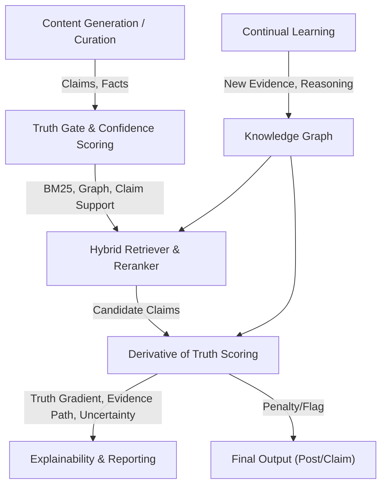
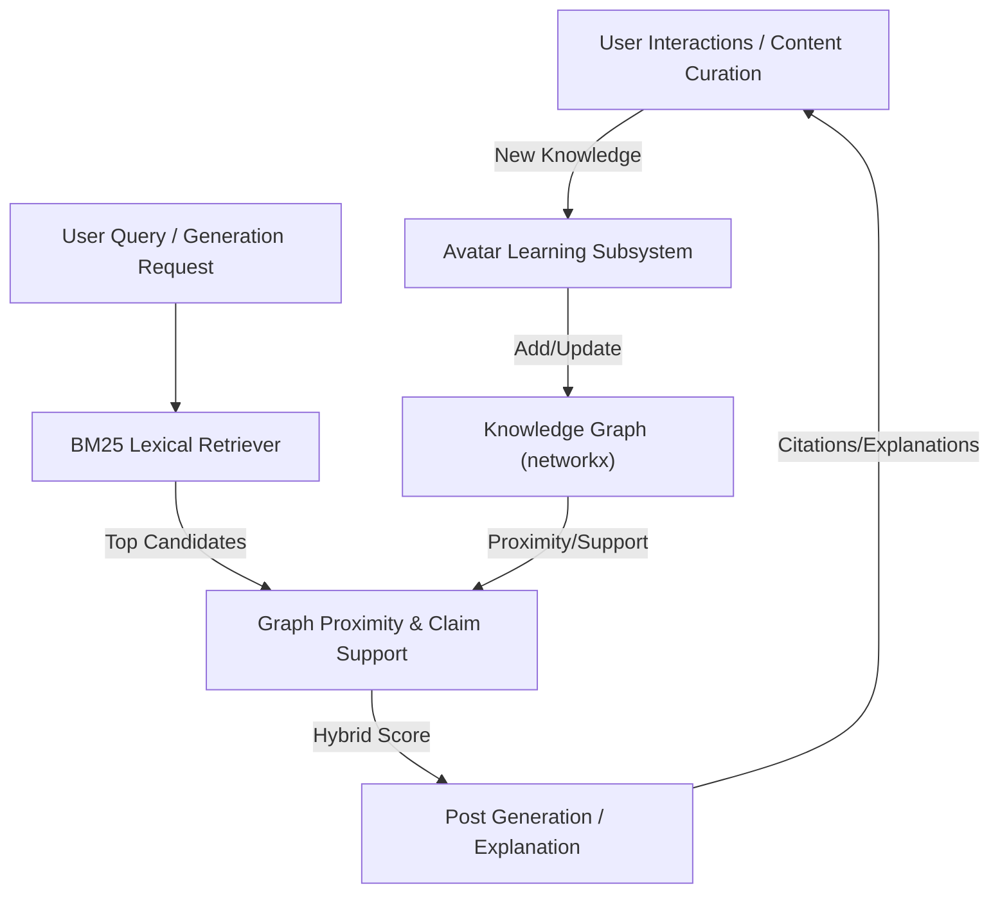

# LinkedIn SSI Booster

#### _<u> — Persona-Grounded Truth-Gated Adaptive-Continual-Learning Hybrid-RAG Agent with Domain Knowledge Graph</u>_

[](LICENSE)[]()

**LinkedIn SSI Booster** isn't just a prompt wrapper — it's an adaptive continual learning automation system for content, curation, and persona growth. It combines spaCy-based NLP, a persona graph, BM25 retrieval, a truth gate, confidence scoring, a NetworkX-powered knowledge graph, and local memory to generate, curate, rank, and route posts with more control and explainability than a basic AI writer workflow.

## 🧠 Intelligence Stack — Why This Is Smarter Than Just 'AI Writes Posts'

- **Advanced NLP with spaCy** — Theme/claim extraction, semantic similarity, sentiment/tone analysis, and two advanced curation/grounding features:
  - **Fact Suggestion:** When the truth gate drops a sentence, spaCy suggests the closest matching fact or evidence from your persona graph, or recommends how to rephrase for grounding.
  - **Contextual Summarization:** spaCy generates concise, context-aware summaries of curated articles, improving the quality of commentary and learning signals.
- **Persona-grounded generation** — Every post is written in your real technical voice, with facts, projects, and outcomes pulled from your private persona graph and knowledge graph (not just keywords or a bio blurb).
- **Hybrid RAG + agent pipeline** — Combines BM25 retrieval, deterministic validation, multi-step agent orchestration, and a hybrid BM25+graph reranker for high factuality, persona-awareness, and variety.
- **Curation learning loop** — The system tracks every generated candidate, learns which ones you actually publish, and automatically floats the best sources/topics to the top in future runs (Beta-smoothed acceptance priors per source/SSI component).
- **Truth gate** — Post-generation filter removes unsupported claims (numbers, dates, company names, project-tech mismatches) for maximum credibility.
  - Uses a BM25 evidence strength check to score each sentence against article text and persona facts.
  - Sentences with BM25 scores below the threshold are flagged as weakly supported and may be removed.
  - Strict token matching is also applied for numeric claims, years, dollar amounts, and company names.
- **Confidence scoring & policy routing** — Each post is scored for grounding, novelty, and repetition; you control what gets scheduled, sent to Ideas, or blocked entirely.
- **Memory & repetition penalty** — The system remembers recent themes and claims, penalizing repeated angles so your feed stays fresh.
- **Explainability & learning reports** — CLI flags let you see exactly which facts grounded each post, trace graph-based support, and generate advisory reports from moderation history.
- **No cloud AI keys required** — All generation is local (Ollama), with persona and learning data stored only on your machine.

**Result:** You get a self-improving, persona-driven content engine that adapts to your taste, avoids repetition, and systematically grows your SSI — with full transparency, control, and explainability.

---

### 🏆 What is the LinkedIn SSI?

The [LinkedIn Social Selling Index](https://www.linkedin.com/sales/ssi) is a 0–100 score LinkedIn updates daily. It measures how effectively you build your personal brand, find the right people, engage with insights, and build relationships — the four pillars LinkedIn's algorithm uses to determine how widely your content and profile are surfaced to others.

A higher SSI directly correlates with more profile views, post reach, and inbound connection requests. LinkedIn's own data shows that professionals with an SSI above 70 get 45% more opportunities than those below 30.

The score breaks down into four components (25 points each):

| Component                             | What LinkedIn measures                                                            |
| ------------------------------------- | --------------------------------------------------------------------------------- |
| **Establish your professional brand** | Completeness of profile, consistency of posting, saves/shares on your content     |
| **Find the right people**             | Profile searches landing on you, connection acceptance rate, right-audience reach |
| **Engage with insights**              | Shares, comments, and reactions on industry content; thought leadership signals   |
| **Build relationships**               | Connection growth, message response rate, relationship depth                      |

### 🤖 Why automate it?

SSI decays if you go quiet — LinkedIn penalises inconsistency. Manually writing 3 posts per week, curating industry articles with original commentary, and maintaining an on-brand voice across hundreds of posts is simply not sustainable alongside a full-time engineering role.

This tool handles the repeatable parts:

- **Consistent cadence** — 3 posts/week scheduled to Buffer at proven engagement times (Tue/Wed/Fri 4 PM EST)
- **On-brand content** — every post is grounded in your real projects, real numbers, and real technical voice via a detailed persona prompt
- **All four SSI pillars** — the content calendar and curator rotate across all four components so no single pillar is neglected
- **Curation pipeline** — fetches today's AI/GovTech news, filters by your niche, and generates commentary that you can either:
  - push to Buffer Ideas for review and manual approval (default), or
  - schedule directly as posts to your Buffer queue (using `--type post`)

You control whether curated content is reviewed before publishing or scheduled directly. The tool removes the blank-page problem, but you decide what goes live.

---

## 🚀 Schedule Your Content with Buffer (Partner Link)

Want to automate your LinkedIn growth with the best scheduling tool? [Sign up for Buffer with our partner link](https://join.buffer.com/samjd42) and get started in minutes!

**Why Buffer?**

- Effortlessly schedule posts at optimal times for maximum reach
- Manage multiple channels and queues from one dashboard
- Integrates seamlessly with LinkedIn SSI Booster for hands-off publishing

**Support the project:** Using our [Buffer partner link](https://join.buffer.com/samjd42) helps fund ongoing development and keeps this tool open-source. Try Buffer today and see why top creators and engineers trust it for their content workflow!

---

## 🔍 Learning, Grounding, and Explainability Pipeline

**How the system learns and adapts:**

- **Candidate logging:** Every generated post and curated article candidate is logged, including source, topic, and all relevant metadata. This creates a full audit trail of what the system considered, not just what was published.
- **Reconciliation & learning:** When you publish or reject posts (via Buffer or moderation), the system reconciles what actually went live. It updates acceptance rates (priors) for each source, topic, and SSI component, so future curation floats the best-performing sources and topics to the top.
- **Ranking:** Article and post candidates are ranked using a combination of acceptance priors and BM25 retrieval scores, so the system learns your preferences over time and adapts what it suggests.

**How deterministic grounding and the truth gate work:**

- **Fact retrieval:** For every post or answer, the system retrieves relevant facts from your persona graph (projects, skills, outcomes) using BM25Okapi — a production-grade IR algorithm. This ensures rare, high-signal skills and projects are prioritized.
- **Prompt balance rules:** Prompts require every factual claim to be grounded in either the article or your persona facts. Personal references are capped, and invented stats/dates/companies are forbidden.
- **Truth gate:** After generation, a deterministic filter removes any sentence with unsupported numbers, dates, company names, or project-tech mismatches unless the claim is found in your evidence. This keeps outputs credible and on-brand.

---

## 🧮 Derivative of Truth Framework

> ### The Derivative of Truth: A New Mathematical Framework for AI Truthfulness
>
> **The Core Problem:**
> Current AI systems optimize for next token prediction, which can lead to reward hacking—models sound confident about memorized patterns, not about evidence.

> **Breakthrough Insight:**
> Truth is subjective and dynamic. Instead of solving for absolute truth T, we optimize for dT/dt—the derivative of truth, representing movement toward more reliable knowledge.
>
> **Key Mathematical Components:**
>
> - **Truth-Seeking Loss:**
>
>   L_current = -log P(next_token | context)
>
>   L_truth = -log P(truth_direction | evidence, reasoning, uncertainty)
>
> - **Derivative of Truth:**
>
>   dT/dt = ∂(Evidence Quality)/∂t + ∂(Reasoning Strength)/∂t - ∂(Uncertainty)/∂t
>
> - **Truth Gradient:**
>
>   ∇(Evidence × Reasoning × Consistency) - ∇(Uncertainty × Bias)
>
> - **Truth Score:**
>
>   T(statement) = Σ [E_i × R_i × C_i × U_i]
>
>   Where E_i is evidence strength, R_i is reasoning validity, C_i is source credibility, U_i is uncertainty penalty.
>
> **The Key Insight:**
> Don't solve for truth directly—solve for the trajectory toward truth. This makes the model reward-seeking for reliable knowledge, not just confident pattern matching.

The Derivative of Truth framework augments the existing truth gate and confidence scoring pipeline with a new scoring subsystem that explicitly models evidence strength, reasoning validity, and uncertainty. It introduces a truth gradient metric for every generated claim/post, and integrates with the knowledge graph, hybrid retriever, continual learning, and explainability/reporting subsystems.

### 🚩 Why This Approach Is Revolutionary

Most AI content tools rely on black-box vector search or generic LLM outputs, which are hard to audit, explain, or trust. The LinkedIn SSI Booster’s Derivative of Truth framework is different:

- **Deterministic, auditable, and explainable:** BM25 and token matching provide transparent, reproducible evidence scoring, enabling precise truthfulness and uncertainty annotation.
- **Fine-grained control:** You can set exact thresholds for what counts as “supported,” especially for numbers, names, and facts—something vector search can’t reliably do.
- **Actionable feedback:** The system gives clear, actionable explanations for why claims are accepted or rejected, helping users and moderators improve content quality.
- **Bridges IR and AI:** By combining traditional information retrieval (BM25) with modern AI, the system is both robust and trustworthy—unlike most current AI automation tools.
- **Sets a new bar for trustworthy AI:** This approach is rare in today’s content automation landscape and is a strong step toward explainable, compliance-ready AI for real-world workflows.

In short, this framework brings a new level of transparency, reliability, and control to automated content generation—making it ideal for professional, compliance-sensitive, and high-stakes environments.

### 🔄 How Learning, Truth Gate, and Scoring Improve Future Generations

The system’s continual learning and truth gate scoring directly shape the quality of future content:

- **Curation Learning Loop:** Every generated post and curated article is logged with its truth gate score, evidence support, and publication outcome. Acceptance rates (priors) for sources, topics, and SSI components are updated based on what gets published or rejected. Over time, the system floats the best-performing patterns and demotes weak ones.

- **Adaptive Retrieval and Grounding:** The retrieval layer learns which facts, themes, and evidence types are most likely to pass the truth gate. Future generations are more likely to ground claims in high-confidence, well-supported facts, making outputs more credible and relevant.

- **Prompt and Policy Adaptation:** The LLM is guided by prompts that require factual grounding. As the system learns which claims are accepted, it adapts prompt constraints and retrieval strategies to favor those patterns. Confidence scoring and policy routing reinforce high-quality output.

- **Feedback to the LLM:** When a post is rejected by the truth gate, the system suggests the closest matching facts or evidence, helping you or the LLM rephrase or better ground the claim. Over time, the LLM “learns” (via prompt engineering, retrieval adaptation, and user feedback) to avoid unsupported patterns and generate more credible content.

- **Continual Learning:** As new facts and evidence are added (from curated articles, RSS feeds, etc.), the knowledge graph grows, providing richer grounding for future generations. Retrieval and scoring adapt to leverage this expanding evidence base.

**Bottom line:**
The system closes the loop between generation, evidence retrieval, truth gate scoring, and user feedback—so each new generation is smarter, more credible, and better aligned with your SSI goals.

Key benefits:

- **Explicit Truthfulness Scoring:** Every claim/post receives a "truth gradient" score reflecting evidence strength, reasoning validity, and uncertainty, going beyond simple fact-checking.
- **Evidence & Reasoning Annotation:** Each fact/claim is annotated with evidence type, reasoning type, and source credibility for transparency and explainability.
- **Uncertainty Handling:** Tracks and penalizes uncertainty (weak evidence, long chains, conflicts, sparse support), flagging overconfident or unsupported claims.
- **Improved Explainability:** CLI and reports show why claims are accepted/rejected, what evidence supports them, and how uncertainty affects scores.
- **Better Content Quality:** Filters out weak claims, prioritizes well-grounded ones, and ensures published content is credible and authoritative.
- **Adaptive Learning:** As more evidence and reasoning paths are accumulated, scoring and explanations improve, making automation smarter over time.
- **Alignment with Best Practices:** Follows trustworthy AI and explainable AI (XAI) principles for robust, future-proof automation.

#### 🛡️ Truth Gate & Confidence Scoring Pipeline



See [docs/features/derivative-of-truth/](docs/features/derivative-of-truth/) for technical details, schema, and scoring examples.

---

## 🧩 Knowledge Graph Choice: NetworkX Core, Neo4j for Expansion

The core knowledge graph is implemented with NetworkX, an in-memory Python graph library. This choice is intentional:

- **Simplicity & Speed:** NetworkX is fast, pure Python, and ideal for small to medium graphs (well under 100k nodes/edges), which covers all core persona, domain, and learning knowledge for a single avatar.
- **Tight, Local Core:** By keeping the avatar's core knowledge graph tight and local, the system remains fast, debuggable, and easy to extend—no external dependencies or infrastructure required.
- **Scalability Policy:** If the knowledge graph ever needs to scale to millions of nodes/edges (e.g., for mass knowledge injection, multi-avatar, or enterprise use), the system is designed to support Neo4j as a drop-in backend. Neo4j provides persistent, disk-backed storage and a powerful query language (Cypher) for large-scale or multi-user scenarios.
- **Best of Both Worlds:** For most users, NetworkX is more than sufficient. Neo4j is reserved for future expansion, bulk import, or advanced analytics—keeping the core avatar experience lightweight and local-first.

**Current graph size:** The combined domain and learning knowledge graphs are well below 1,000 nodes—orders of magnitude under any practical NetworkX limit.

See the chart below for a summary of trade-offs:

| Feature/Constraint    | NetworkX (Current)                               | Neo4j (Future Option)                         |
| --------------------- | ------------------------------------------------ | --------------------------------------------- |
| Storage               | In-memory (RAM only)                             | On-disk, persistent                           |
| Scale                 | Best for small/medium graphs (<100k nodes/edges) | Scales to millions/billions of nodes/edges    |
| Query Language        | Python API, no query language                    | Cypher query language                         |
| Performance           | Fast for small graphs, slows with size           | Optimized for large, complex queries          |
| Persistence           | No built-in persistence                          | Full persistence, ACID compliance             |
| Integration           | Simple, pure Python                              | Requires running Neo4j server, extra setup    |
| Learning/Dev Overhead | Minimal, easy to use                             | Higher, requires Cypher and DB management     |
| Use Case Fit          | Prototyping, research, local automation          | Production, multi-user, large-scale analytics |
| Cost                  | Free, no infra                                   | Free (Community), but infra/ops required      |

**Bottom line:** The core of the avatar will remain in NetworkX for speed, simplicity, and local-first operation. Neo4j is available for future expansion, mass knowledge injection, or advanced analytics if needed.

---

The system now includes a NetworkX-powered knowledge graph for incremental learning, hybrid BM25+graph retrieval, and persona-aware reranking.

**Integration Philosophy:**

- BM25 (lexical retrieval) remains the primary candidate selector for claims, project details, facts, narrative memory, and learned article summaries.

- The NetworkX knowledge graph is used as a secondary, persona-aware reranker and explainer: it links persona ↔ skills ↔ projects ↔ claims ↔ domain facts.

- Final candidate scoring is a hybrid:

  $$
  ext{final} = 0.7 \times \text{bm25} + 0.2 \times \text{graph proximity} + 0.1 \times \text{claim support}
  $$

### 🧬 Hybrid Retrieval and Scoring Architecture



## 🔄 Continual Learning (NLP-Extracted Knowledge)

> **Inspiration:** This subsystem is inspired by the work of Dr. Ben Goertzel (SingularityNET) and the OpenCog team on AtomSpace and MeTTa, bringing incremental, explainable cognition to practical automation. [Making AI learning AGI-capable: continual learning, transfer learning, lifelong learning - YouTube](https://youtu.be/n10J1OjmgLM)

The avatar supports fully automatic, incremental continual learning from new content streams (e.g., RSS feeds, curated articles) via an NLP-extracted knowledge graph. As new content is processed, spaCy is used to extract, structure, and normalize new facts, terms, and relationships. The system deduplicates and validates these facts, merging them into the knowledge graph alongside persona and domain knowledge.

- Extracted knowledge is stored in `data/avatar/extracted_knowledge.json` and is automatically merged into the knowledge graph and BM25 candidate pool.
- These new facts are used in both retrieval (BM25 and graph) and grounding, so your system's evidence base grows over time with no manual steps.
- Deduplication and normalization ensure that only novel, high-quality knowledge is added, and all learning is ongoing as new content is ingested.
- Modular, file-based design: easy to extend, debug, and test.

See [docs/features/continual-learning/idea.md](docs/features/continual-learning/idea.md) for technical details and schema.

- **Adaptive Curation Ranking:** The system tracks every generated and published post, learning which sources, topics, and themes you actually approve. Over time, it floats the best-performing sources and topics to the top using Beta-smoothed acceptance priors and theme-based ranking.
- **Semantic Repetition Detection:** Uses spaCy-powered semantic similarity to detect and penalize repeated or paraphrased content, keeping your feed fresh and non-redundant.
- **User Feedback Integration:** You can upvote, downvote, or override candidate posts, and this feedback is incorporated into future ranking and selection.
- **Fact Suggestion for Truth Gate:** When a sentence is dropped for lacking evidence, the system suggests the closest matching facts from your persona graph or extracted knowledge to help you rephrase or ground your claims.
- **Memory & Narrative Learning:** The system maintains a local memory of recent themes and claims, using this to diversify future outputs and avoid repetition.
- **Explainability & Learning Reports:** CLI flags like `--avatar-explain` and `--avatar-learn-report` let you see exactly what the system has learned, which facts grounded each post (including those from continual learning), and which sources or topics are most effective.

**Bottom line:** The more you use it, the smarter and more tailored your content pipeline becomes — adapting to your preferences, audience, and SSI goals. All new knowledge is immediately available for both retrieval and grounding, powering the hybrid pipeline.

---

Core capabilities include:

- Persona-grounded generation using structured profile facts from `data/avatar/persona_graph.json`.
- Hybrid RAG orchestration with BM25 retrieval, prompt constraints, and deterministic post-processing.
- Curation learning that updates acceptance priors from what actually gets published.
- Explainability features such as `--avatar-explain` and `--avatar-learn-report`.
- Local-first operation using Ollama, with persona and learning data stored on your own machine.

The writing rules draw on **Neuro-Linguistic Programming (NLP)** principles — specifically pattern interrupts (scroll-stopping first lines), presupposition (assuming the reader already cares), and anchoring (pairing your name with specific technical outcomes so readers associate _you_ with the domain). The forbidden-phrases list functions as a negative anchor removal layer: stripping hollow corporate phrases forces the model toward concrete, specific language that builds credibility. For the theoretical underpinning, see [_Monsters and Magical Sticks, There's no Such Thing as Hypnosis?_ by Steven Heller & Terry Steele](https://www.amazon.com/Monsters-Magical-Sticks-Theres-Hypnosis-ebook/dp/B007WMOMXU) — an accessible introduction to how language patterns shape perception.

Notes: https://richardstep.com/downloads/tools/Notes--Monsters-and-Magic-Sticks.pdf

NLP primer in this repo:

- [docs/nlp-basics.md](docs/nlp-basics.md)

The primer covers core NLP concepts, practical communication techniques, technical writing examples, and ethical usage guidelines.

## 🗺️ Docs map

- [Setup guide](docs/setup.md) — environment, dependencies, persona graph, and calendar setup.
- [Architecture guide](docs/architecture.md) — learning pipeline, grounding flow, truth gate, and curation ranking.
- [Persona and Avatar Intelligence](docs/persona-and-avatar.md) — persona graph, system prompt, memory, confidence, explainability, and continual learning.
- [Continual Learning (NLP-extracted knowledge)](docs/features/continual-learning/idea.md) — how the avatar accumulates new knowledge from external content.
- [Domain Knowledge Graph](docs/domain-knowledge.md) — domain-level expertise that isn't tied to specific projects.
- [Usage guide](docs/usage-schedule-curate-console.md) — scheduling, curation, console mode, channels, and CLI examples.
- [SSI strategy](docs/ssi-and-strategy.md) — SSI model, content mapping, scheduler behavior, and reporting.
- [AI backend](docs/ai-backend-and-models.md) — Ollama setup and model recommendations.
- [Testing and development](docs/testing-and-dev.md) — pytest coverage and project structure. All tests pass (241/241) including knowledge graph and hybrid retrieval features.
- [Selection learning](docs/selection-learning.md) — candidate logging, reconciliation, and acceptance priors.

## ⚡ Quickstart

```bash
python -m venv .venv
source .venv/bin/activate
pip install -r requirements.txt
python -m spacy download en_core_web_sm
cp .env.example .env
cp data/avatar/persona_graph.example.json data/avatar/persona_graph.json
cp data/avatar/domain_knowledge.example.json data/avatar/domain_knowledge.json
cp data/avatar/narrative_memory.example.json data/avatar/narrative_memory.json
cp content_calendar.example.py content_calendar.py
python main.py --schedule --week 1 --dry-run
```

### ⚙️ Environment Variables

Add these to your `.env` file:

```
BUFFER_API_KEY=...
OLLAMA_MODEL=gemma4:26b
OLLAMA_MODEL_FALLBACK=qwen2.5:14b  # (optional, fallback model for YouTube Shorts)
OLLAMA_BASE_URL=http://localhost:11434
```

- `OLLAMA_MODEL` — Main Ollama model for all generations (e.g. `gemma4:26b`).
- `OLLAMA_MODEL_FALLBACK` — Fallback model for YouTube Shorts if the main model fails (default: `qwen2.5:14b`).
- `OLLAMA_BASE_URL` — Ollama server URL (default: `http://localhost:11434`).

The setup flow requires a configured `.env`, a filled-in persona graph, a narrative memory file, and a personalized content calendar before useful scheduling or curation runs begin.

## 📄 License

[MIT License](LICENSE) — see LICENSE for details.
