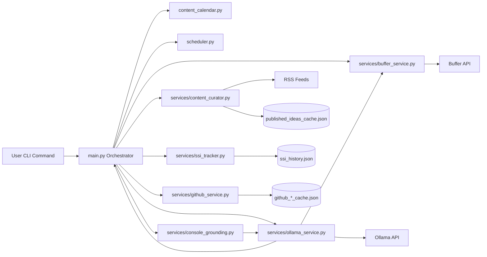
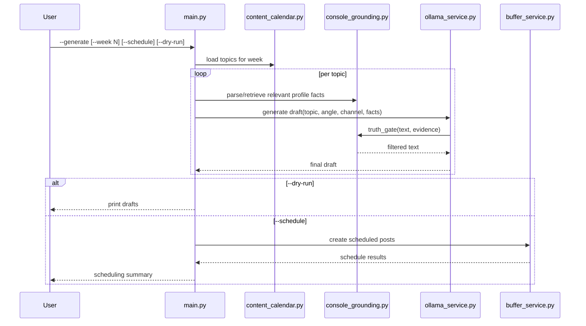
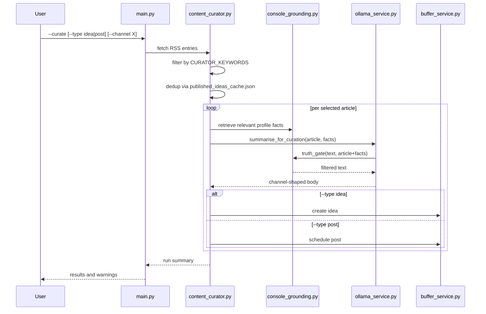
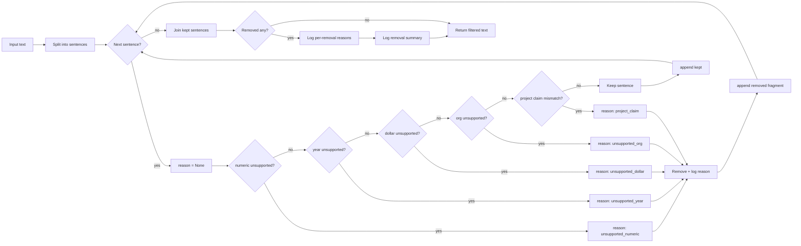

# Technical Design Document: LinkedIn SSI Booster Platform

## 1. Architecture Overview

LinkedIn SSI Booster is a CLI-first, service-oriented Python application that orchestrates AI-assisted content production across four stages:

1. Strategy: select and weight content plans by SSI component.
2. Intelligence: generate grounded post drafts from persona, profile, and article context.
3. Deterministic safety: validate and prune unsupported claims.
4. Distribution and feedback: schedule/publish via Buffer and track SSI trends.

Design style:

- Monolithic CLI application with modular service boundaries.
- External API interactions isolated to dedicated services.
- Deterministic validation layered after probabilistic generation.
- Config-first behavior through `.env` values.

### 1.1 Architecture Diagram

## 2. System Context

Primary external systems:

- Ollama local inference server for text generation.
- Buffer API for idea creation and post scheduling.
- RSS sources for curation content ingestion.
- LinkedIn SSI user input as periodic manual score snapshots.

Primary internal modules:

- `main.py` (orchestration and command routing)
- `content_calendar.py` (weekly topic source)
- `scheduler.py` (slot and allocation logic)
- `services/ollama_service.py` (generation and channel shaping)
- `services/content_curator.py` (RSS pipeline and dedup)
- `services/console_grounding.py` (fact parsing, retrieval, truth gate)
- `services/buffer_service.py` (Buffer integration)
- `services/ssi_tracker.py` (score persistence/reporting)
- `services/github_service.py` (profile enrichment)

## 3. High-Level Data Flow

### 3.1 Generate Flow (`--generate`)

1. Load config and assembled profile context.
2. Load week topics from `content_calendar.py`.
3. Retrieve relevant profile facts for each topic/angle.
4. Generate channel-aware draft using `OllamaService`.
5. Apply deterministic truth gate post-generation.
6. If `--dry-run`, print output.
7. If `--schedule`, create scheduled posts in Buffer according to slots.

### 3.2 Curate Flow (`--curate`)

1. Read RSS feeds and fetch article entries.
2. Filter by `CURATOR_KEYWORDS`.
3. Shuffle and deduplicate against `published_ideas_cache.json`.
4. For each selected article:

- Retrieve relevant profile facts.
- Generate reaction draft from article text.
- Apply truth gate.
- Assemble final body/url/hashtags by channel policy.

5. Push as ideas (`--type idea`) or scheduled posts (`--type post`).

### 3.3 Console Flow (`--console`)

1. Parse profile facts from loaded context.
2. For factual/project queries, return deterministic grounded reply with sources.
3. For non-factual prompts, use persona chat generation path.

### 3.4 SSI Flow (`--save-ssi`, `--report`)

1. Persist score snapshot in `ssi_history.json`.
2. Compute trend and component-level recommendations.

### 3.5 Generate Flow Sequence

### 3.6 Curate Flow Sequence

## 4. Component Design

### 4.1 CLI Orchestrator (`main.py`)

Responsibility:

- Parse arguments and route execution path.
- Assemble profile context (base profile + optional GitHub enrichment).
- Invoke service flows with appropriate mode/channel parameters.

Interfaces:

- CLI flags for generate/curate/console/report/save-ssi.
- Calls into service classes/functions only (no direct API logic).

Dependencies:

- All service modules.
- Environment config and local cache files.

### 4.2 Generation Service (`services/ollama_service.py`)

Responsibility:

- Build prompts from persona, SSI goals, profile facts, and article/topic inputs.
- Enforce channel-specific format guidance (LinkedIn/X/Bluesky/YouTube script mode).
- Run truth gate after generation.

Interfaces:

- `generate_linkedin_post(...)`
- `summarise_for_curation(...)`
- `chat_as_persona(...)`

Dependencies:

- Ollama client.
- `services.console_grounding.truth_gate`.
- Shared prompt constants and cleanup/format helpers.

### 4.3 Grounding Service (`services/console_grounding.py`)

Responsibility:

- Parse project facts from `PROFILE_CONTEXT`.
- Extract query constraints and retrieve relevant fact subset.
- Build deterministic grounding blocks for prompt injection.
- Apply truth gate checks for unsupported numeric/date/org/project-claim sentences.

Interfaces:

- `parse_profile_project_facts(...)`
- `parse_query_constraints(...)`
- `retrieve_relevant_facts(...)`
- `build_grounding_facts_block(...)`
- `truth_gate(...)`

Design notes:

- Project-claim checks use phrase/alias-aware evidence text matching.
- Reason-coded logs support tuning and incident analysis.

### 4.4 Curation Service (`services/content_curator.py`)

Responsibility:

- Fetch and filter RSS entries.
- Deduplicate by title cache.
- Generate curated post drafts and push to Buffer.

Interfaces:

- Curate pipeline methods triggered by `main.py`.

Dependencies:

- Feed parser.
- Ollama service for summarization.
- Buffer service for delivery.
- Local JSON cache for dedup.

### 4.5 Buffer Service (`services/buffer_service.py`)

Responsibility:

- Encapsulate Buffer API calls for profile lookup, idea creation, and scheduled posting.

Interfaces:

- methods for create idea/schedule post per channel profile.

Dependencies:

- Buffer API key.
- Network connectivity and Buffer profile configuration.

### 4.6 Scheduler (`scheduler.py`)

Responsibility:

- Translate weekly content + SSI weights into posting allocation.
- Convert timezone slot definitions to scheduled timestamps.

Interfaces:

- scheduling helpers called from generate workflow.

Dependencies:

- timezone config and slot configuration.

### 4.7 SSI Tracker (`services/ssi_tracker.py`)

Responsibility:

- Save component snapshots.
- Produce trend-aware report and action recommendations.

Interfaces:

- score persistence and report generation methods.

Dependencies:

- local JSON history file.

## 5. Data Model and Storage

### 5.1 Core Runtime Data

- Topic item:
- `title`
- `angle`
- `ssi_component`
- `hashtags`

- ProjectFact:
- `project`
- `company`
- `years`
- `details`
- `source`
- `tags`

- QueryConstraints:
- `require_projects`
- `require_companies`
- `tech_tags`

### 5.2 Local State Artifacts

- `published_ideas_cache.json`: title dedup store for curated pushes.
- `ssi_history.json`: serialized SSI snapshots.
- GitHub caches (`github_repos_cache.json`, README cache) for profile enrichment performance.

### 5.3 Configuration Surface

- Required:
- persona/profile context variables.
- Buffer key.
- Ollama endpoint/model.

- Optional:
- channel behavior and schedule slots.
- grounding keyword and tag expansion controls.
- context budget caps.

## 6. CLI Contract Design

Primary commands:

- `python main.py --generate [--week N] [--schedule] [--channel ...] [--dry-run]`
- `python main.py --curate [--type idea|post] [--channel ...] [--dry-run]`
- `python main.py --console`
- `python main.py --save-ssi <brand> <find> <engage> <build>`
- `python main.py --report`

Behavioral contracts:

- `--dry-run` must avoid Buffer side effects.
- `--channel all` executes channel-specific logic with graceful per-channel failure handling.
- LinkedIn curation output assembly order remains deterministic: body -> URL -> hashtags.

## 7. Deterministic Safety Design

Safety layers:

1. Retrieval grounding: inject only relevant profile facts.
2. Prompt balance rules: prohibit unsupported factual claims.
3. Truth gate: prune unsupported specific claims per sentence.

Truth gate checks:

- numeric claims
- year references
- dollar amounts
- org name patterns
- project-technology misattributions

Observability:

- per-sentence reason-code logging for removals.
- aggregate summary logging for each processed output.

### 7.1 Truth-Gate Decision Logic

## 8. Error Handling and Resilience

Error handling principles:

- Catch specific exceptions for network/API failures.
- Return actionable logs with context (channel, URL, command mode).
- Continue partial progress where safe (multi-channel degradation).

Failure examples:

- RSS source timeout: skip source, continue with remaining feeds.
- Buffer channel unavailable: warn and continue other channels.
- Empty/short article: skip and record warning.

## 9. Security Considerations

- Secrets are read from environment variables only.
- `.env` is local and excluded from source control.
- No API keys persisted in logs or generated outputs.
- Profile context is local input; no outbound sync beyond generation/publishing calls.

## 10. Performance Considerations

- Cap prompt context size with configurable budgets.
- Limit article ingestion per feed.
- Use local caches for GitHub context and dedup checks.
- Keep truth gate lightweight and sentence-local to minimize added latency.

## 11. Testing and Validation Strategy

### 11.1 Functional Validation

- Smoke test each command mode:
- generate dry-run
- generate schedule
- curate idea mode
- curate post mode
- console factual and free-form prompts
- report and save-ssi

### 11.2 Deterministic Validation

- Validate truth gate reason-code behavior on known cases:
- unsupported numeric/date/org
- valid project-tech statements
- invalid project-tech statements
- phrase/alias edge cases (`hybrid search`, `mcp`/`fastmcp`)

### 11.3 Release Validation

- Compare dry-run outputs before/after prompt or grounding changes.
- Ensure README and env docs reflect behavior/config changes.

## 12. Implementation Slices (AI-TDD)

Slice A: Generation Reliability

- stabilize prompt templates and channel formatting contracts.

Slice B: Curation Quality

- improve feed filtering/dedup robustness and curated draft consistency.

Slice C: Grounding Safety

- maintain and extend deterministic truth gate and logging diagnostics.

Slice D: Multi-Channel Robustness

- enforce channel constraints with graceful degradation policies.

Slice E: SSI Feedback Optimization

- improve report actionability and tuning loop from component trends.

## 13. Open Questions

1. Should truth-gate strictness eventually expose optional profiles (standard/strict)?
2. Should release validation include automated fixture-based checks in CI?
3. Should curation selection prioritize novelty scoring beyond keyword matching?
4. Should SSI reporting include suggested content calendar adjustments automatically?

## 14. Definition of Done

A release of current work is done when:

1. All CLI flows run successfully in dry-run and expected live modes.
2. Deterministic grounding and truth gate perform as documented.
3. Multi-channel behavior is compliant and resilient to partial failures.
4. SSI save/report loop is operational and trend-aware.
5. Documentation remains aligned with implemented behavior and config surface.
