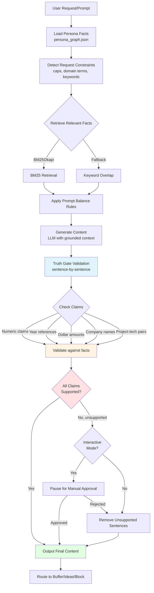
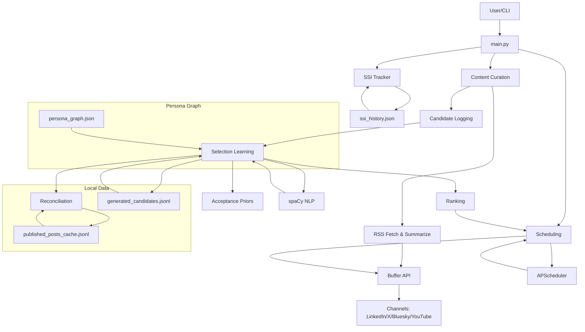

# Architecture Guide

LinkedIn SSI Booster is built as a persona-grounded, hybrid retrieval and generation system with deterministic validation layers around model output. Its architecture combines local generation, profile fact retrieval, candidate logging, adaptive ranking, and post-generation truth filtering.

## Core pipeline

The project describes itself as a practical “Persona Graph · Truth-Grounded Learning · Hybrid RAG” workflow rather than a single prompt call. The main flow is retrieve relevant facts with BM25, generate with channel-aware rules, validate unsupported claims deterministically, then publish or route content through Buffer.

High-level stages include:

- Retrieval grounding from persona facts using BM25Okapi.
- Prompt orchestration for LinkedIn, X, Bluesky, and YouTube outputs.
- Deterministic truth-gate filtering after generation.
- Scheduling, curation, and SSI-balanced operational routing.

## Learning pipeline

The learning loop logs every generated post and curated article candidate, not just published outputs, so the system keeps a full audit trail of what it considered. It then reconciles published or rejected outcomes to update acceptance priors per source, topic, and SSI component, allowing future ranking to adapt to real publishing choices.

The ranking layer combines acceptance priors with BM25-style relevance signals so the best-performing content sources rise over time. This gives the project a practical feedback loop rather than a static generate-and-forget behavior.

## Deterministic grounding

Grounding is designed to reduce hallucinated personal claims by forcing outputs to stay anchored to known profile facts. The grounding pipeline loads persona facts, detects request constraints, retrieves relevant facts with BM25Okapi or a keyword-overlap fallback, applies prompt balance rules, and then removes unsupported claim sentences in a truth-gate pass.

The README states that prompt constraints require factual claims to come from article text or profile facts, cap personal references, and forbid invented stats, dates, and company names. It also notes that project-specific technology attribution is constrained so a named project can only be paired with technologies present in its own detail field.

## Truth gate

The truth gate evaluates sentences independently and removes only those that contain unsupported specific claims. It checks numeric claims, year references, dollar amounts, company-style context patterns, and project-technology misattributions against available article text or retrieved persona facts.

The gate does not rewrite text, and it is intentionally conservative rather than acting as a full external fact-checker. The documentation also notes support for an `--interactive` mode that pauses on flagged sentences for manual approval.

### Deterministic Grounding & Truth Gate Flow

Below is a visual representation of how deterministic grounding and the truth gate operate:

If your Markdown viewer does not support Mermaid, the flow is: Load persona facts → Detect constraints → Retrieve facts (BM25 or keyword fallback) → Apply prompt rules → Generate content → Truth gate validates each sentence → Check claims against facts → Remove unsupported claims (or interactive approval) → Output final content → Route to destination.

## Environment controls

Grounding relevance can be tuned through `.env` values such as `CONSOLE_GROUNDING_TECH_KEYWORDS`, `CONSOLE_GROUNDING_TAG_EXPANSIONS`, and `TRUTH_GATE_DOMAIN_TERMS`. For curation, keyword matching can also fall back to `CURATOR_KEYWORDS`, which makes retrieval quality dependent on the overlap between article vocabulary and configured domain terms.

## Curation ranking

The curation pipeline ranks articles with a weighted formula that combines keyword relevance, freshness decay, and adaptive acceptance priors. Deduplication is handled through a local cache, and every selected article becomes a logged candidate before or after Buffer routing, depending on the flow.

This architecture means the project learns not only from the model prompt context, but also from the operational outcome of what users approve, publish, or ignore.

## System Architecture Diagram

Below is a high-level system architecture diagram for the LinkedIn SSI Booster:

If your Markdown viewer does not support Mermaid, refer to the textual architecture description above.
