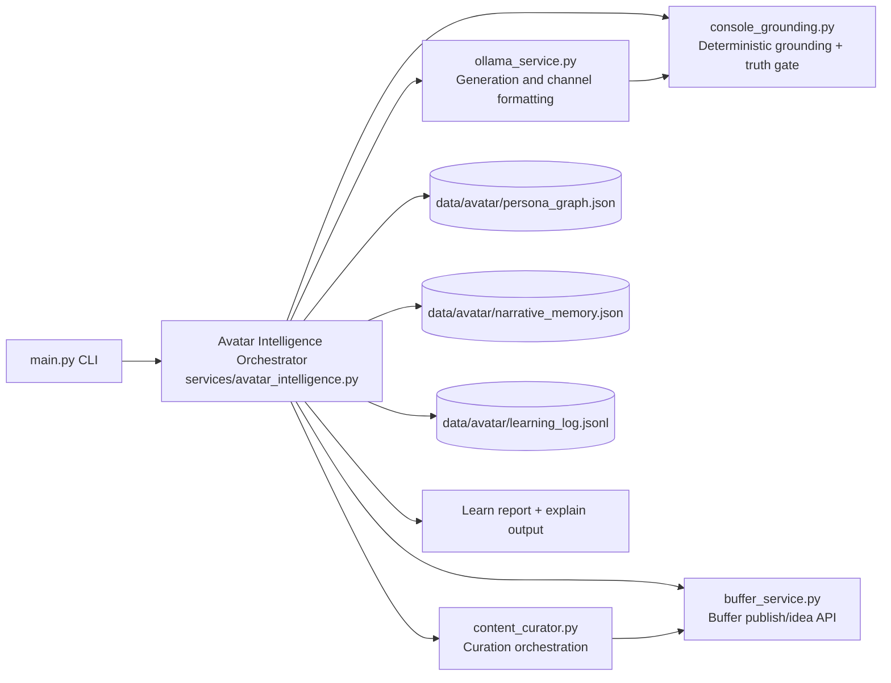
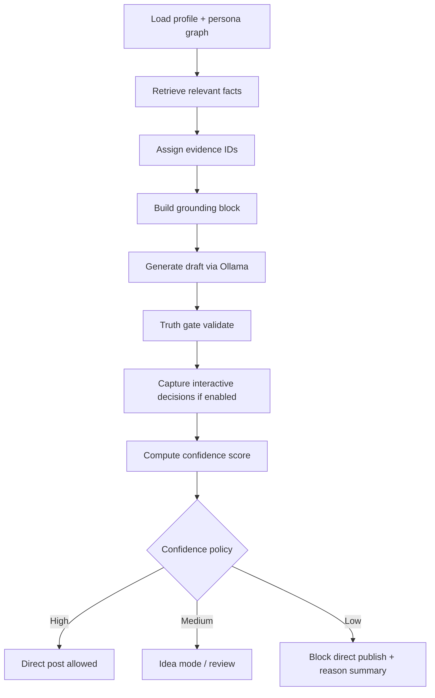
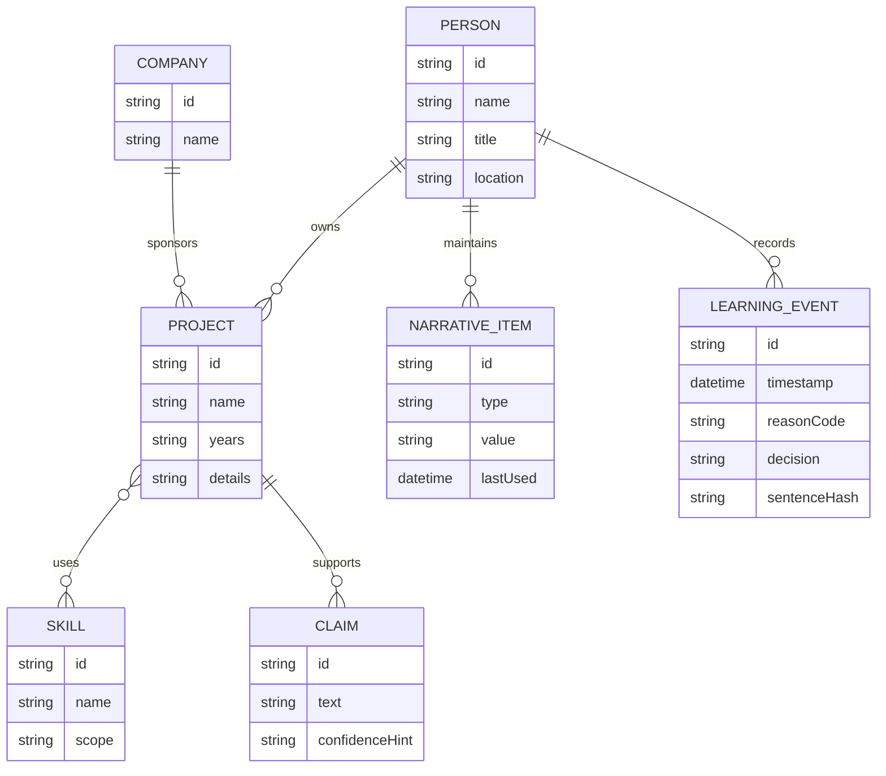
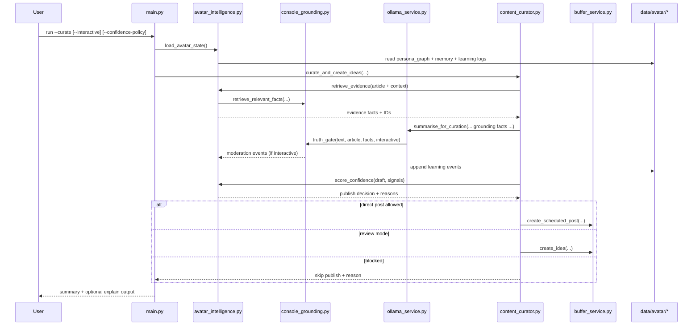

# Technical Design: Avatar Intelligence and Learning Engine

## 1. Overview

This design implements the PRD for Avatar Intelligence and Learning Engine as an incremental enhancement to the existing LinkedIn SSI Booster pipeline.

Design goals:

- Preserve current generation/curation behavior by default.
- Add structured identity, explainable evidence, learning loop, confidence policy, and narrative continuity.
- Keep deterministic safety checks intact.

## 2. Architecture

### 2.1 High-level component architecture

### 2.2 Runtime flow with confidence gate

## 3. Design Principles

- Backward compatible first: no mandatory migration for existing users.
- Deterministic safety preserved: current reason checks stay active.
- Human-in-the-loop learning: suggestions only, no autonomous config changes.
- Explainability by default-ready: evidence IDs and optional explain reports.

## 4. Module Design

### 4.1 New module: services/avatar_intelligence.py

Responsibilities:

- Load and validate persona graph and memory files.
- Normalize facts and assign evidence IDs.
- Build explainable grounding context blocks.
- Score confidence and enforce policy decisions.
- Record learning events from truth-gate interactions.
- Generate recommendations from repeated moderation patterns.

Core interfaces:

- `load_avatar_state() -> AvatarState`
- `retrieve_evidence(query, facts) -> list[EvidenceFact]`
- `build_grounding_context(evidence_facts) -> str`
- `score_confidence(draft, signals) -> ConfidenceResult`
- `decide_publish_mode(policy, confidence, requested_mode) -> PublishDecision`
- `record_learning_event(event) -> None`
- `build_learning_report() -> LearningReport`

### 4.2 main.py integration

Changes:

- Add optional CLI flags:
  - `--avatar-explain`
  - `--avatar-learn-report`
  - `--confidence-policy strict|balanced|draft-first`
- Route generate/curate operations through Avatar Intelligence orchestrator hooks.
- Keep existing behavior when flags/config are absent.

### 4.3 console_grounding.py integration

Changes:

- Add graph-backed fact input path while preserving current parser fallback.
- Preserve current reason checks:
  - `unsupported_numeric`
  - `unsupported_year`
  - `unsupported_org`
  - `project_claim`
- Provide optional evidence ID references for explain mode.

### 4.4 ollama_service.py integration

Changes:

- Accept evidence-enriched grounding snippets in prompts.
- Return metadata needed by confidence scoring (length pressure, claim density hints).
- Maintain channel-specific behavior (LinkedIn/X/Bluesky/YouTube).

### 4.5 content_curator.py integration

Changes:

- Capture interactive truth-gate decisions in learning log.
- Apply confidence policy before direct post scheduling.
- Attach decision reason to logs and dry-run output.

## 5. Data Model Design

### 5.1 Persona graph file

Path: `data/avatar/persona_graph.json`

Proposed schema (v1):

- `schemaVersion: string`
- `person: { name, title, location, links[] }`
- `projects[]: { id, name, companyId, years, details, skills[], aliases[] }`
- `companies[]: { id, name, aliases[] }`
- `skills[]: { id, name, aliases[], scope: domain|project_specific }`
- `claims[]: { id, text, projectIds[], confidenceHint }`

### 5.2 Narrative memory file

Path: `data/avatar/narrative_memory.json`

Proposed schema (v1):

- `recentThemes[]`
- `recentClaims[]`
- `openNarrativeArcs[]`
- `lastUpdated`

### 5.3 Learning log file

Path: `data/avatar/learning_log.jsonl`

Each line event:

- `timestamp`
- `channel`
- `reasonCode`
- `decision: kept|removed`
- `sentenceHash`
- `articleRef`
- `projectRefs[]`
- `runId`

### 5.4 Data model diagram

## 6. Sequence Design

### 6.1 Curate flow with learning and policy

## 7. Confidence Scoring Design

### 7.1 Signals

- `truth_gate_removed_count`
- `truth_gate_reason_severity`
- `grounding_coverage_ratio`
- `unsupported_claim_pressure`
- `channel_length_pressure`
- `narrative_repetition_score`

### 7.2 Policy mapping

- strict:
  - high -> post
  - medium/low -> idea or block
- balanced:
  - high/medium -> post
  - low -> idea or block
- draft-first:
  - all -> idea unless explicit override flag

### 7.3 Explain output

When `--avatar-explain` is enabled, return:

- selected evidence IDs
- confidence score + contributing signals
- final publish decision + reason summary

## 8. Learning Engine Design

### 8.1 Event capture

Trigger points:

- Interactive truth-gate sentence decisions.
- Confidence-policy route decision (post/idea/block).
- Optional post-publication outcome summary (future phase).

### 8.2 Recommendation logic (rule-based v1)

- If repeated `project_claim` kept by user on same term -> suggest domain-term candidate.
- If repeated numeric removals with known source references missing -> suggest retrieval keyword/tag expansion review.
- If repeated low confidence due to length pressure -> suggest channel prompt adjustment.

### 8.3 Reporting

`--avatar-learn-report` outputs:

- top reason codes by frequency
- top kept-vs-removed mismatch patterns
- suggested tuning actions with confidence labels

## 9. Configuration Design

Add to `.env.example`:

- `AVATAR_CONFIDENCE_POLICY=balanced`
- `AVATAR_LEARNING_ENABLED=true`
- `AVATAR_MAX_MEMORY_ITEMS=200`

Behavior:

- Missing config uses defaults.
- Invalid policy values fall back to `balanced` with warning.

## 10. Error Handling and Fallbacks

- Missing `data/avatar/*` files:
  - Log warning and continue with current deterministic flow.
- Malformed JSON schema:
  - Log validation errors and disable avatar intelligence features for that run.
- Learning log write failure:
  - Continue generation/publish path; emit warning only.
- Confidence engine exception:
  - Default decision to existing requested mode and log fallback reason.

## 11. Security and Privacy

- Keep learning and memory files local.
- No external telemetry in v1.
- Sentence content stored as hash in learning log for privacy-preserving trend analysis.

## 12. Performance Design

- In-memory caches for persona graph and recent memory windows per run.
- Bounded memory list size using `AVATAR_MAX_MEMORY_ITEMS`.
- Rule-based confidence and recommendation logic (no extra model calls in v1).

## 13. Test Strategy

### 13.1 Unit tests

- Persona graph schema validation.
- Evidence ID stability and mapping.
- Confidence score computation and policy mapping.
- Learning recommendation generation rules.

### 13.2 Integration tests

- Curate with interactive mode and learning-log persistence.
- Generate with explain mode output.
- Fallback behavior when avatar files are absent.

### 13.3 Regression tests

- Ensure existing truth-gate checks remain functionally unchanged.
- Validate no regressions in channel formatting constraints.

## 14. Rollout Plan

Phase 1A:

- Add avatar intelligence module and data files (read-only retrieval support).

Phase 1B:

- Add learning event capture and report generation.

Phase 1C:

- Add confidence scoring and policy enforcement.

Phase 1D:

- Add narrative continuity memory injection.

## 15. Design Decisions Summary

- Keep deterministic safety and human approval central.
- Introduce intelligence incrementally with explicit fallbacks.
- Treat explainability and learning as first-class outputs, not side effects.
- Preserve compatibility with existing commands and operational workflow.
