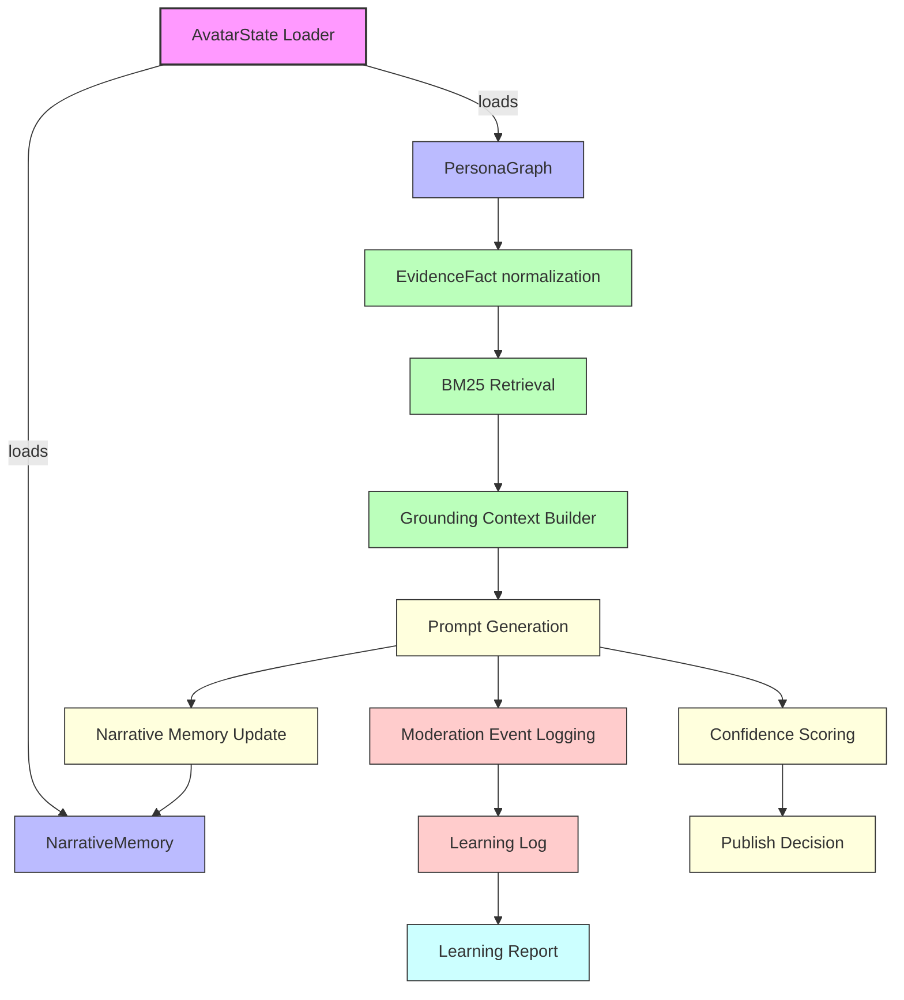

# Avatar Intelligence Engine

This module powers the persona-driven, context-grounded generation and learning system for the LinkedIn SSI Booster. It manages persona graph loading, evidence normalization, BM25-based retrieval, grounding context construction, moderation event logging, learning reports, and narrative memory.

---

## High-Level Architecture

---

## Key Components

### 1. AvatarState Loader

- Loads the persona graph and narrative memory from disk.
- Validates schema and provides safe fallback if missing or invalid.

### 2. PersonaGraph & EvidenceFact Normalization

- PersonaGraph: Structured data about the person, projects, companies, skills, and claims.
- EvidenceFact: Normalized, stable facts extracted from PersonaGraph projects for retrieval.

### 3. BM25 Retrieval

- Uses BM25Okapi (if available) to score and rank evidence facts for a query.
- Tokenizes project, company, years, details, and skills (skills are weighted higher).
- Returns the most relevant facts for grounding.

### 4. Grounding Context Builder

- Formats top evidence facts into a prompt-ready context block for LLM generation.

### 5. Moderation Event Logging & Learning Log

- Captures every truth-gate moderation event (kept/removed sentences, reasons, etc.).
- Appends to an append-only JSONL log for learning and reporting.

### 6. Learning Report

- Aggregates moderation events into actionable insights and recommendations.

### 7. Confidence Scoring & Publish Decision

- Scores each generation for confidence using multiple signals (removal rate, severity, coverage, etc.).
- Applies policy to decide publish route: post, idea, or block.

### 8. Narrative Memory

- Tracks recent themes, claims, and open arcs for continuity and repetition avoidance.
- Updated after each generation and used to build continuity context for prompts.

---

## BM25 Retrieval Details

- Each evidence fact is tokenized (project, company, years, details, skills).
- Skills are repeated 3x to boost their importance in scoring.
- BM25 scores each fact for the query; top-N are selected for grounding.
- If BM25 is unavailable, a fallback keyword overlap scoring is used.

---

## File: services/avatar_intelligence.py

- All logic described above is implemented in this file.
- Entry points: `load_avatar_state()`, `normalize_evidence_facts()`, `retrieve_evidence()`, `build_grounding_context()`, `record_moderation_event()`, `build_learning_report()`, `score_confidence()`.

---

For further details, see the code and docstrings in [services/avatar_intelligence.py](../services/avatar_intelligence.py).
