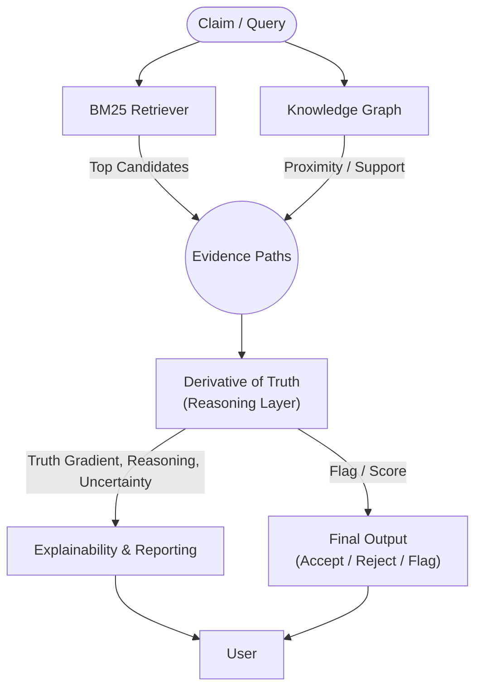
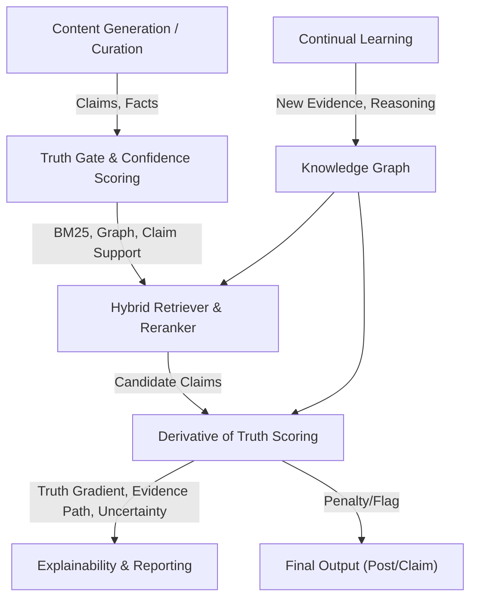

# 🧮 Derivative of Truth (DoT) Framework

The Derivative of Truth (DoT) is the reasoning layer that sits on top of BM25 retrieval and the knowledge graph. Rather than treating truth as a binary pass/fail, it scores every generated sentence against a composite gradient: evidence quality × reasoning strength × source credibility × claim-evidence token overlap. Sentences below the threshold are flagged and removed before a post is published.

---

## How BM25, the Knowledge Graph, and DoT Work Together



- **BM25** finds the most relevant evidence for each sentence based on token overlap — transparent, reproducible, and auditable.
- **The Knowledge Graph** encodes relationships between persona, projects, facts, and evidence. It enables proximity scoring and explicit reasoning chains so you can trace why a fact supports a claim.
- **Hybrid scoring** combines BM25's lexical precision with graph-based proximity/support: high recall from BM25, high precision from graph reranking.
- **The DoT layer** sits on top of retrieval. For each sentence it:
  - Annotates evidence by type (primary, secondary, derived, pattern), reasoning (logical, statistical, analogy, pattern), and credibility.
  - Computes **claim-evidence token overlap** (Jaccard) — how much the generated text's language actually reflects the supporting evidence.
  - Aggregates quality, reasoning type, credibility, and overlap into a single composite score.
  - Tracks and penalizes uncertainty (weak evidence, long inference chains, conflicts, sparse support).
  - Produces a single interpretable truth gradient score and explains why a claim is strong or weak.

**In effect, DoT turns the system into not just a retriever but a reasoner — able to justify, explain, and flag claims based on both the quality of their evidence _and_ how faithfully the LLM output reflects that evidence.**

---

## Mathematical Framework

> ### The Derivative of Truth: A New Mathematical Framework for AI Truthfulness
>
> **The Core Problem:**
> Current AI systems optimize for next token prediction, which can lead to reward hacking — models sound confident about memorized patterns, not about evidence.
>
> **Breakthrough Insight:**
> Truth is subjective and dynamic. Instead of solving for absolute truth T, we optimize for dT/dt — the derivative of truth, representing movement toward more reliable knowledge.
>
> **Key Mathematical Components:**
>
> - **Truth-Seeking Loss:**
>   `L_current = -log P(next_token | context)`
>   `L_truth = -log P(truth_direction | evidence, reasoning, uncertainty)`
> - **Derivative of Truth:**
>   `dT/dt = ∂(Evidence Quality)/∂t + ∂(Reasoning Strength)/∂t - ∂(Uncertainty)/∂t`
> - **Truth Gradient:**
>   `∇(Evidence × Reasoning × Consistency) - ∇(Uncertainty × Bias)`
> - **Truth Score:**
>   `T(statement) = Σ [E_i × R_i × C_i × U_i]`
>   Where E_i is evidence strength, R_i is reasoning validity, C_i is source credibility, U_i is uncertainty penalty.
> - **Implemented `base_gradient` formula (with claim-evidence overlap O_i):**
>   With overlap: `0.30×E_i + 0.25×R_i + 0.20×C_i + 0.25×O_i`
>   Without overlap (KG-only paths): `0.40×E_i + 0.35×R_i + 0.25×C_i`
>   O_i ∈ [0,1] is the Jaccard token overlap between the LLM output and the supporting evidence text.
>
> **The Key Insight:**
> Don't solve for truth directly — solve for the trajectory toward truth. This makes the model reward-seeking for reliable knowledge, not just confident pattern matching.

See [The Derivative of Truth — A New Mathematical Framework for AI Truthfulness](The%20Derivative%20of%20Truth_%20A%20New%20Mathematical%20Framework%20for%20AI%20Truthfulness.pdf) (PDF) for the full paper.

---

## Truth Gate Pipeline

The truth gate runs five checks in sequence on every sentence after generation. DoT gradient scoring is the second layer.



### Layers in execution order

| Layer | Check | Reason code | Scope |
|---|---|---|---|
| **Part A** — BM25 evidence scoring | Sentence ranked against article text + persona facts below `TRUTH_GATE_BM25_THRESHOLD` | `weak_evidence_bm25` | All contexts |
| **Part B** — DoT per-sentence gradient | `0.30×evidence + 0.25×reasoning + 0.20×credibility + 0.25×token_overlap` below `TRUTH_GRADIENT_FLAG_THRESHOLD` (0.35) | `weak_dot_gradient` | All contexts |
| **Part C** — Article spaCy sim | Sentences containing numeric claims, years, dollar amounts, or org names below `TRUTH_GATE_SPACY_SIM_FLOOR` (0.10) vs source article | `low_semantic_similarity` | Curation only (requires non-empty article text) |
| **Part D** — spaCy NER org-name | ORG entities not found in allowed evidence set; false-positive filters skip concept/service tokens (`S3`, `AI Q&A`, `Java 21`) and known project substrings | `unsupported_org` | All contexts |
| **Part E** — Fact-pool spaCy sim | Best spaCy cosine similarity vs each persona/domain fact below `TRUTH_GATE_FACT_SIM_FLOOR` (0.05); 0.0 (vectors unavailable) is exempt | `low_fact_similarity` | All contexts including console mode |

### DoT vs spaCy sim — what each check catches

| | DoT gradient | Article spaCy sim (Part C) | Fact-pool spaCy sim (Part E) |
|---|---|---|---|
| **Question asked** | *Is this claim supported by credible, well-reasoned evidence?* | *Does the generated text still mean the same thing as the source?* | *Is this sentence at least semantically close to something I know to be true?* |
| **Input** | Sentence vs. persona/domain fact pool | Sentence vs. source article text | Sentence vs. each persona/domain fact individually |
| **Method** | Weighted formula: `0.30×E + 0.25×R + 0.20×C + 0.25×O` | spaCy `en_core_web_md` cosine similarity | spaCy `en_core_web_md` cosine similarity (best match across all facts) |
| **Scope** | All contexts (curation + console) | Curation only | All contexts including console mode |
| **Catches** | Weak evidence chains — passes BM25 + token checks but has poor reasoning quality, low credibility, or low token overlap with facts | Paraphrased hallucinations that drift in meaning but share no tokens with the article | Sentences with no semantic connection to any known persona or domain fact |
| **Threshold** | `TRUTH_GRADIENT_FLAG_THRESHOLD` = 0.35 | `TRUTH_GATE_SPACY_SIM_FLOOR` = 0.10 | `TRUTH_GATE_FACT_SIM_FLOOR` = 0.05 |
| **Reason code** | `weak_dot_gradient` | `low_semantic_similarity` | `low_fact_similarity` |

### Relevant env vars

| Env var | Default | Purpose |
|---|---|---|
| `TRUTH_GATE_BM25_THRESHOLD` | `0.75` | Minimum BM25 score vs article + persona facts (Part A) |
| `TRUTH_GRADIENT_FLAG_THRESHOLD` | `0.35` | Minimum DoT truth gradient to keep a sentence (Part B) |
| `TRUTH_GATE_SPACY_SIM_FLOOR` | `0.10` | Minimum spaCy sim vs source article for specific-claim sentences (Part C) |
| `TRUTH_GATE_FACT_SIM_FLOOR` | `0.05` | Minimum spaCy sim vs best-matching persona/domain fact (Part E) |

---

## Inline Truth Score (Console Mode)

After every AI-generated reply in `--console` mode, a one-line indicator is printed:

```
Sam> [reply text]
  ● DoT 0.82  fact sim 0.71
```

- `●` green ≥ 0.75 — well-grounded; `◑` yellow ≥ 0.45 — moderate; `○` red < 0.45 — weakly supported.
- `fact sim` is the best Part E spaCy similarity across persona/domain facts (omitted if no facts matched).
- Article spaCy sim is excluded in console mode — there is no source article in a conversation.
- Only AI-generated replies receive the indicator; deterministic grounded replies do not.

Use `--dot-report` with `--schedule` or `--curate` for a full truth gradient, evidence path, and uncertainty breakdown on every generated post.

---

## Why This Approach Is Different

Most AI content tools rely on black-box vector search or generic LLM outputs, which are hard to audit, explain, or trust. This framework is different:

- **Deterministic, auditable, and explainable:** BM25 and token matching provide transparent, reproducible evidence scoring, enabling precise truthfulness and uncertainty annotation.
- **Fine-grained control:** Exact thresholds for what counts as "supported" — something vector search can't reliably do, especially for numbers, names, and technical claims.
- **Actionable feedback:** Clear, actionable explanations for why claims are accepted or rejected.
- **Bridges IR and AI:** Combines traditional information retrieval (BM25) with modern AI — robust _and_ trustworthy.
- **Claim-evidence alignment visible in CLI:** Each evidence path carries a token overlap score (weak / moderate / strong) shown in the `--dot-report` output, revealing when LLM language drifts from its grounding facts.
- **Sets a new bar for trustworthy AI:** Explainable, compliance-ready, and rare in today's content automation landscape.

---

## How DoT Improves Over Time

The system's continual learning and truth gate scoring directly shape the quality of future content:

- **Curation learning loop:** Every generated post is logged with its truth gate score, evidence support, and publication outcome. Acceptance priors for sources, topics, and SSI components update from what actually gets published. The system floats the best-performing patterns and demotes weak ones.
- **Adaptive retrieval and grounding:** The retrieval layer learns which facts, themes, and evidence types are most likely to pass the truth gate. Future generations ground claims in higher-confidence, better-supported facts.
- **Feedback to the LLM:** When a post is rejected, the system surfaces the closest matching facts or evidence to help rephrase or better ground the claim.
- **Growing evidence base:** As new facts are extracted from curated articles (via `--learn`), the knowledge graph expands, providing richer grounding for future generations.

---

## Technical Details

- Implementation: `services/derivative_of_truth/` (`_models.py`, `_scoring.py`, `_reporting.py`)
- Truth gate: `services/console_grounding/_truth_gate.py`
- Config knobs: `services/console_grounding/_config.py`
- Feature design notes: [docs/features/derivative-of-truth/](features/derivative-of-truth/)
