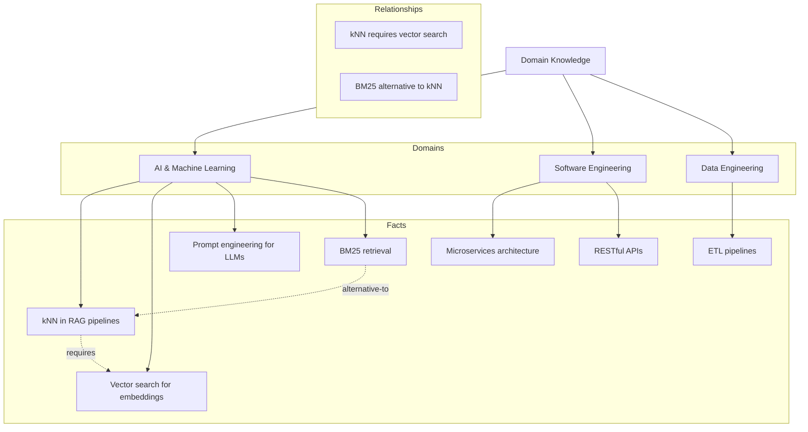
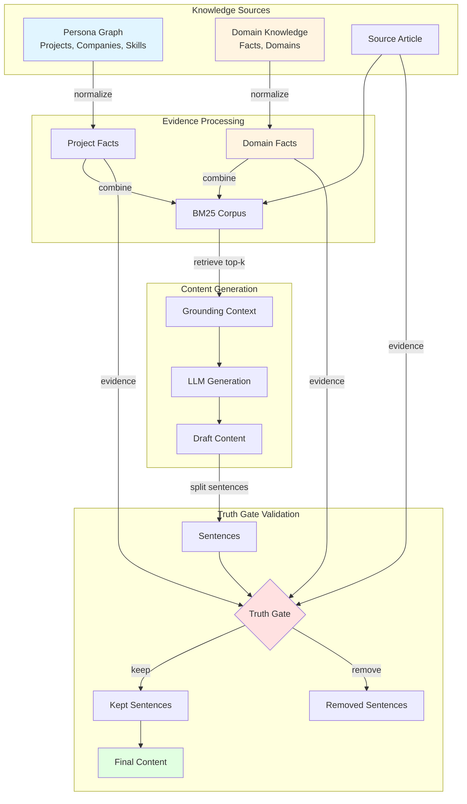

# Domain Knowledge Graph

## Overview

The **Domain Knowledge Graph** is a companion feature to the persona graph that allows you to express general, domain-level expertise that isn't tied to specific projects. This enables the system to make bold, field-wide claims while maintaining robust truth gating.

## Purpose

While the persona graph contains **project-specific facts** (what you did, where, when, with what stack), many valuable insights are **domain-level knowledge** that applies broadly across your field:

- **General best practices**: "Effective prompt engineering is crucial for getting consistent outputs from LLMs"
- **Technical truths**: "kNN is commonly used in RAG pipelines for semantic similarity search"
- **Architectural patterns**: "Microservices architecture enables independent deployment and scaling"

Previously, these claims would be flagged by the truth gate unless they appeared in your persona graph or the source article. The domain knowledge graph solves this by providing a **second evidence source** for general professional knowledge.

## Benefits

1. **Expressive Voice**: Make confident, general claims that reflect your expertise, not just your project history
2. **Robust Truth Gating**: The system remains protected against hallucination while being less brittle
3. **Personalized Authority**: Curate a knowledge graph that represents _your_ areas of expertise and preferred perspectives

This source serves as a structured knowledge graph that maps the intricate connections between modern AI and machine learning, software engineering, and data engineering. It organizes technical information into a formal schema consisting of distinct domains, verified factual statements, and the interconnected relationships that bind them together. The primary focus of the text is the architectural synergy within AI pipelines, specifically highlighting how Retrieval-Augmented Generation (RAG) utilizes tools like vector search and Large Language Models to produce grounded outputs. By documenting the dependencies between programming languages, frameworks, and emerging technologies like agentic systems, the source provides a comprehensive blueprint for understanding how contemporary computing components function as a unified ecosystem.

## Schema

### Visual Structure



The domain knowledge graph uses a JSON structure similar to the persona graph:

```json
{
  "schemaVersion": "1.0",
  "domains": [
    {
      "id": "ai-ml",
      "name": "AI & Machine Learning",
      "description": "Artificial Intelligence and Machine Learning concepts"
    }
  ],
  "facts": [
    {
      "id": "fact-knn-rag",
      "domainId": "ai-ml",
      "statement": "k-Nearest Neighbors (kNN) is commonly used in RAG pipelines for semantic similarity search.",
      "tags": ["kNN", "RAG", "retrieval", "semantic search"],
      "confidence": "high",
      "scope": "general"
    }
  ],
  "relationships": [
    {
      "id": "rel-1",
      "fromFactId": "fact-knn-rag",
      "toFactId": "fact-vector-search",
      "relationType": "requires",
      "description": "kNN in RAG requires vector search capabilities"
    }
  ]
}
```

### Field Definitions

**Domains**:

- `id`: Unique identifier for the domain (kebab-case)
- `name`: Human-readable domain name
- `description`: Brief description of what this domain covers

**Facts**:

- `id`: Unique identifier for the fact
- `domainId`: Reference to the domain this fact belongs to
- `statement`: The factual claim or knowledge statement
- `tags`: Array of relevant keywords/topics (used for retrieval)
- `confidence`: Confidence level (`high`, `medium`, `low`)
- `scope`: Scope of applicability (typically `general`)

**Relationships** (optional):

- `id`: Unique identifier for the relationship
- `fromFactId`: Source fact ID
- `toFactId`: Target fact ID
- `relationType`: Type of relationship (`requires`, `alternative-to`, `extends`, etc.)
- `description`: Human-readable description of the relationship

## Setup

1. **Create your domain knowledge file**:

   ```bash
   cp data/avatar/domain_knowledge.example.json data/avatar/domain_knowledge.json
   ```

2. **Customize the content**:
   - Add domains that match your areas of expertise
   - Add facts that represent your professional knowledge
   - Tag facts with relevant keywords for retrieval

3. **The system automatically loads it**:
   - Domain knowledge is loaded alongside the persona graph
   - If the file is missing, the system continues without it (optional feature)
   - Errors are logged but don't prevent the tool from running

## Architecture

The following diagram shows how domain knowledge integrates with the existing persona graph system:



**Key Points**:

- **Blue**: Persona graph (project-specific knowledge)
- **Orange**: Domain knowledge (general expertise)
- **Red**: Truth gate (validation point)
- **Green**: Final validated output

Both knowledge sources contribute equally to evidence retrieval and truth validation, enabling the system to support both project-specific and domain-level claims.

## How It Works

### Evidence Retrieval

**Important architectural detail (2026-04):**

> The system retrieves top-N persona facts and top-N domain facts **separately** (using the same query), then merges them for grounding and truth gating. This avoids type-mismatch errors, allows for future tuning of the split, and enables explainable evidence selection. (Previously, all facts were combined into a single BM25 corpus, which caused issues when fact types differed.)

**Retrieval steps:**

1. **Loads both graphs**: Persona graph (projects) + domain knowledge graph (general facts)
2. **Retrieves top-N persona facts**: BM25 or keyword retrieval from the persona graph (e.g., N=3)
3. **Retrieves top-N domain facts**: BM25 or keyword retrieval from the domain knowledge graph (e.g., N=2)
4. **Merges results**: Both sets are mapped to a common ProjectFact format for downstream use
5. **Provides grounding context**: The LLM receives both project-specific and domain-level facts

This separation makes it easy to tune the balance between project and domain evidence, and to re-rank or explain the sources of each fact in the future.

Example grounding context:

```
Your background — weave these in naturally when they genuinely connect to the topic:
- [E001-a1b2c3] Project: RAG Pipeline | Company: Acme Corp | Years: 2024 | Detail: Built retrieval system using kNN...

Domain expertise — general knowledge you can reference when relevant:
- [D001-d4e5f6] k-Nearest Neighbors (kNN) is commonly used in RAG pipelines for semantic similarity search. (Tags: kNN, RAG, retrieval)
- [D002-g7h8i9] Vector search is essential for modern AI pipelines, enabling semantic similarity matching. (Tags: vector search, embeddings)
```

### Truth Gate Integration

The truth gate now uses domain facts as **additional evidence sources**:

1. **Token Allowlist**: Domain fact statements contribute to the allowed token set
2. **BM25 Scoring**: Sentences are validated against both persona graph AND domain knowledge
3. **Project-Claim Checking**: Domain facts can support tech claims even when not in a specific project

This means a sentence like "kNN is commonly used in RAG pipelines" will pass the truth gate if:

- It appears in the source article, OR
- It's supported by a persona graph project, OR
- **It's supported by a domain knowledge fact** ← NEW

## Best Practices

### Curating Facts

1. **Be truthful**: Only add facts you're confident are accurate and widely accepted
2. **Be specific**: Precise statements are more useful than vague generalizations
3. **Use rich tags**: Good tags improve retrieval (use synonyms, abbreviations, full names)
4. **Avoid project details**: Save project-specific claims for the persona graph

### Organizing Domains

1. **Start broad**: Create 3-5 high-level domains (e.g., "AI & ML", "Software Engineering", "Data Engineering")
2. **Group related facts**: Facts in the same domain should be conceptually related
3. **Add relationships**: Link related facts to show dependencies and alternatives

### Maintenance

1. **Update regularly**: Add new facts as you learn and your expertise evolves
2. **Remove outdated claims**: Technology changes—keep your knowledge current
3. **Review tags**: Periodically audit tags for retrieval effectiveness

## Example Use Cases

### 1. General Best Practices

**Problem**: You want to reference a well-known best practice, but you haven't used it in a specific project.

**Solution**: Add it to domain knowledge:

```json
{
  "id": "fact-12factor",
  "domainId": "software-engineering",
  "statement": "The Twelve-Factor App methodology provides best practices for building modern, scalable web applications.",
  "tags": ["12-factor", "best practices", "web apps", "scalability"],
  "confidence": "high",
  "scope": "general"
}
```

### 2. Technology Relationships

**Problem**: You want to explain how two technologies relate, but you haven't used them together.

**Solution**: Add facts with a relationship:

```json
{
  "facts": [
    {
      "id": "fact-docker",
      "statement": "Docker enables containerization of applications..."
    },
    {
      "id": "fact-k8s",
      "statement": "Kubernetes orchestrates containerized applications..."
    }
  ],
  "relationships": [
    {
      "id": "rel-docker-k8s",
      "fromFactId": "fact-k8s",
      "toFactId": "fact-docker",
      "relationType": "requires",
      "description": "Kubernetes orchestrates Docker containers"
    }
  ]
}
```

### 3. Domain Definitions

**Problem**: You want to define a technical term accurately.

**Solution**: Add a definitional fact:

```json
{
  "id": "fact-rag-def",
  "domainId": "ai-ml",
  "statement": "Retrieval-Augmented Generation (RAG) enhances LLM responses by retrieving relevant documents from a knowledge base before generation.",
  "tags": ["RAG", "retrieval", "LLM", "generation"],
  "confidence": "high",
  "scope": "general"
}
```

## File Location

- **Example**: `data/avatar/domain_knowledge.example.json`
- **Your file**: `data/avatar/domain_knowledge.json`
- **Gitignored**: Yes (add `domain_knowledge.json` to `.gitignore`)

## Integration with Other Features

### Persona Graph

- **Complementary**: Domain knowledge supplements, doesn't replace, the persona graph
- **Different purposes**: Persona graph = "what I did"; domain knowledge = "what I know"
- **Both used together**: The truth gate and evidence retrieval use BOTH sources

### Narrative Memory

- **Independent**: Domain knowledge doesn't affect narrative continuity tracking
- **Static vs. dynamic**: Domain knowledge is manually curated; narrative memory is automatically updated

### Selection Learning

- **Potential future feature**: Could learn which domain facts are most useful and suggest additions

## Troubleshooting

### Domain facts not loading

**Symptoms**: Log message "Domain knowledge not found (optional)"

**Solution**:

```bash
# Check file exists
ls data/avatar/domain_knowledge.json

# Check file is valid JSON
python -c "import json; json.load(open('data/avatar/domain_knowledge.json'))"
```

### Facts not being used as evidence

**Symptoms**: Truth gate still removes sentences that should be supported by domain facts

**Possible causes**:

1. **Tags don't match**: Ensure your tags include keywords from the sentence
2. **Statement wording mismatch**: BM25 scoring depends on word overlap
3. **BM25 threshold too high**: Try lowering `TRUTH_GATE_BM25_THRESHOLD` in `.env`

**Debug**:
Check logs for "Truth gate using X project facts + Y domain facts" to confirm domain facts are loaded.

## Advanced: Version-Specific Knowledge

You can maintain different domain knowledge files for different contexts:

```bash
# Default (general knowledge)
data/avatar/domain_knowledge.json

# Version-specific (if needed in future)
data/avatar/domain_knowledge_python.json
data/avatar/domain_knowledge_java.json
```

The system currently loads only `domain_knowledge.json`, but you can swap files as needed.

## Future Enhancements

Potential future features:

1. **Automatic fact extraction**: Learn domain facts from articles you engage with
2. **Confidence scoring**: Track which facts lead to successful generations
3. **Fact suggestions**: AI-powered suggestions for missing domain facts
4. **Multiple knowledge bases**: Load different domain knowledge for different channels
5. **Fact versioning**: Track when facts were added and updated

## Summary

The domain knowledge graph:

- ✅ Allows you to express general expertise beyond your project history
- ✅ Provides a second evidence source for the truth gate
- ✅ Improves BM25 retrieval with domain-level facts
- ✅ Is optional—the system works without it
- ✅ Is fully integrated with existing persona graph and truth gate features

Start with a small, high-quality set of facts in your core areas of expertise, then expand as needed.
