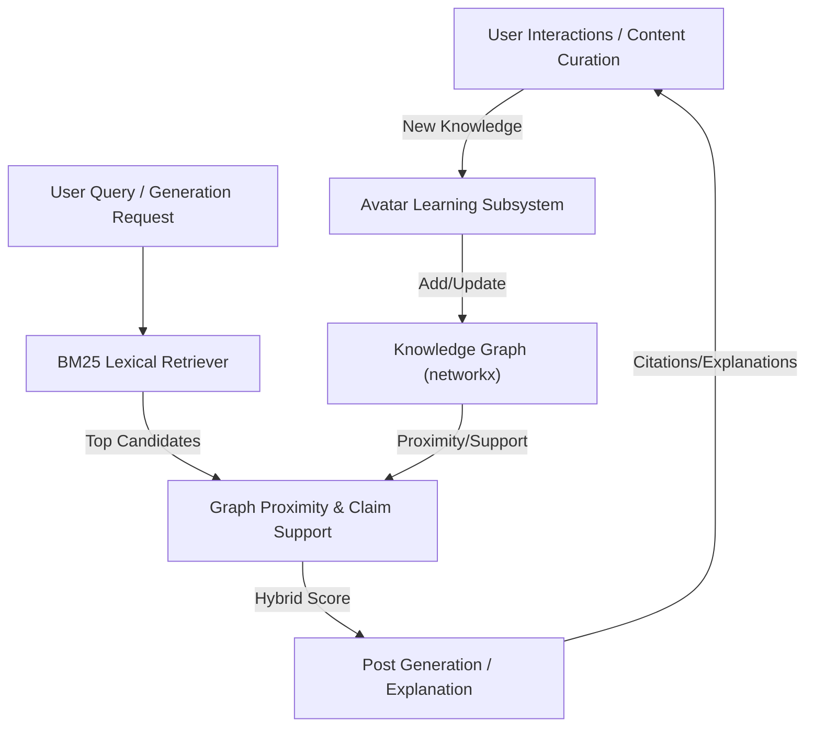
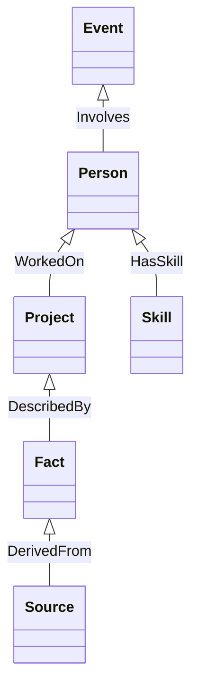
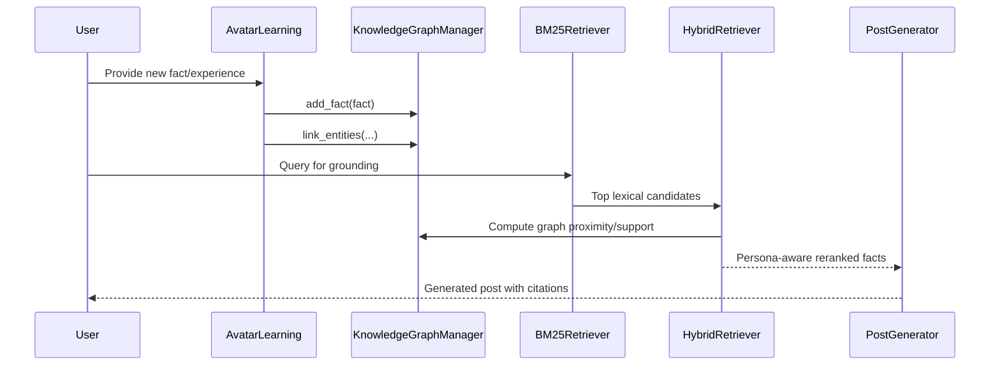

# Technical Design Document: AtomSpace/MeTTa-Inspired Knowledge Graph for Incremental Learning

## 1. Architecture Overview

This design introduces a knowledge graph subsystem to represent, integrate, and reason over new knowledge in the LinkedIn SSI Booster. The subsystem is inspired by AtomSpace/MeTTa and will be implemented as an in-memory hypergraph using Python (e.g., `networkx`).

**Integration Philosophy:**

- BM25 (lexical retrieval) remains the primary candidate selector for claims, project details, facts, narrative memory, and learned article summaries.
- The NetworkX knowledge graph is used as a secondary, persona-aware reranker and explainer: it links persona ↔ skills ↔ projects ↔ claims ↔ domain facts.
- Final candidate scoring is a hybrid:

  $$
  	ext{final} = 0.7 \times \text{bm25} + 0.2 \times \text{graph proximity} + 0.1 \times \text{claim support}
  $$

This approach keeps the current system design intact, while adding graph intelligence with minimal operational burden.

### Mermaid Diagram: Hybrid Retrieval and Scoring Architecture

## 2. Project System Integration

- **Avatar Learning Subsystem:** On learning new facts, adds/updates nodes and links in the knowledge graph.
- **Retrieval Layer:** Uses graph traversal and pattern matching to find relevant facts for grounding, post generation, and explanations.
- **Compatibility:** Existing persona/domain fact ingestion remains supported; deterministic fact retrieval is not broken.
- **Optional:** Expose graph queries for debugging, analytics, or advanced user queries.

## 3. Component Design

### 3.1 Knowledge Graph Subsystem

- **Name:** KnowledgeGraphManager
- **Responsibility:** Manages the in-memory hypergraph, node/link schema, and graph operations (add, update, query, serialize).
- **Interfaces:**
  - `add_fact(fact: dict)`
  - `link_entities(entity1, entity2, link_type, metadata)`
  - `query(pattern)`
  - `get_relevant_subgraph(query_context)`
- **Dependencies:** Python `networkx` (or similar), avatar learning subsystem

### 3.2 Node/Link Schema

- **Nodes:** Person, Project, Skill, Fact, Event, Source, etc.
- **Links:** Typed edges (e.g., WorkedOn, HasSkill, MentoredBy, DerivedFrom)
- **Metadata:** source, confidence, timestamp, etc.

#### Mermaid Diagram: Example Knowledge Graph Schema

### 3.3 Hybrid Retrieval & Reranking Layer

- **Name:** HybridRetriever
- **Responsibility:**
  - Uses BM25 to select top candidate facts/claims from all sources (claims, project details, facts, narrative memory, learned article summaries).
  - Uses the knowledge graph to compute graph proximity (distance from persona to candidate) and claim support (structural/semantic support in the graph).
  - Computes final score as:
    $$
    	ext{final} = 0.7 \times \text{bm25} + 0.2 \times \text{graph proximity} + 0.1 \times \text{claim support}
    $$
  - Returns reranked, persona-aware candidates for grounding and generation.
- **Interfaces:**
  - `find_facts(query_context)`
  - `explain_fact_usage(fact_id)`
- **Dependencies:** KnowledgeGraphManager, BM25Retriever

## 4. Data Model

- **Graph stored in-memory using `networkx.MultiDiGraph` or similar.**
- **Nodes:** Unique IDs, type, attributes (e.g., label, description, metadata)
- **Edges:** Source, target, type, metadata
- **Serialization:** Support for saving/loading graph to disk (e.g., JSON, GraphML)

## 5. API Design

- `add_fact(fact: dict) -> node_id`
- `link_entities(entity1_id, entity2_id, link_type, metadata) -> edge_id`
- `find_facts(query_context) -> List[fact]`
- `explain_fact_usage(fact_id) -> List[path]`
- `serialize_graph(path)` / `load_graph(path)`

## 6. Integration Points

- **Learning:** When new knowledge is acquired, call `add_fact` and `link_entities`.
- **Retrieval:** For post generation or explanation, call `find_facts` and `explain_fact_usage`.
- **Debugging/Analytics:** Optionally expose graph queries for advanced users.

## 7. Security Considerations

- Only trusted subsystems can modify the knowledge graph.
- Input validation for all graph operations.
- (If persisted) Secure file permissions for graph data.

## 8. Performance Considerations

- In-memory graph for fast access; optimize for incremental updates.
- For large graphs, consider lazy loading or switching to a graph DB (e.g., Neo4j).

## 9. Error Handling

- Graceful handling of missing nodes/edges.
- Fallback to deterministic fact retrieval if graph query fails.
- Logging for all graph update/query errors.

## 10. Example Usage

### Mermaid Diagram: Hybrid Retrieval and Reranking Flow

### Scoring Formula

The final candidate score is computed as:

$$
	ext{final} = 0.7 \times \text{bm25} + 0.2 \times \text{graph proximity} + 0.1 \times \text{claim support}
$$

Where:

- **bm25:** Lexical similarity score from the BM25 retriever
- **graph proximity:** Inverse shortest path distance from persona to candidate in the knowledge graph
- **claim support:** Structural/semantic support for the claim in the graph (e.g., number/strength of supporting links)
