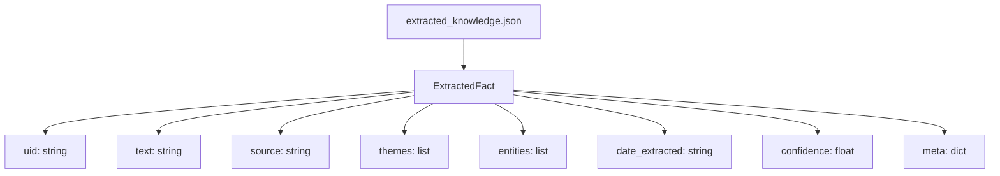
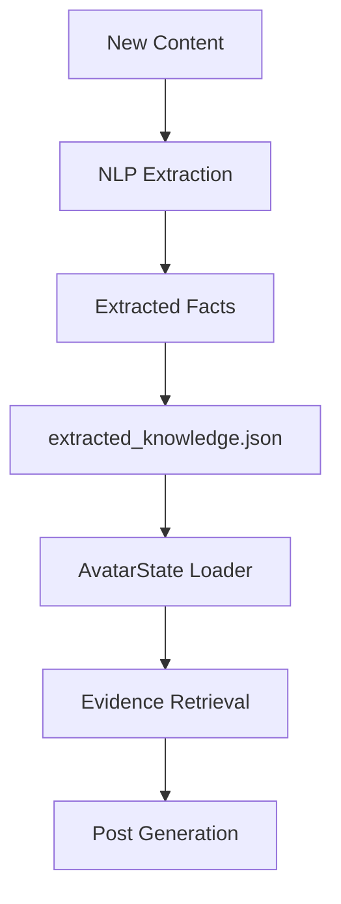

## extracted_knowledge.json Schema

## Status (as of April 19, 2026)

**Current Implementation:**

- `ExtractedFact` and `ExtractedKnowledgeGraph` dataclasses are implemented in `services/avatar_intelligence.py`.
- Loader, validator, and normalizer functions are complete and tested.
- `AvatarState` includes `extracted_knowledge` and loads it as part of the main state.
- `data/avatar/extracted_knowledge.json` exists and is schema-compliant.
- Test coverage: `tests/test_continual_learning.py` covers schema validation, loader, normalization, deduplication, and integration. All tests pass (201/201).
- README and architecture docs reference continual learning and the extracted knowledge graph.
- **NLP extraction pipeline is implemented and in production use:**
  - `services/spacy_nlp.py` provides theme extraction, semantic similarity, sentiment analysis, fact suggestion, and contextual summarization.
  - `services/content_curator.py` uses spaCy for summarizing articles, extracting themes, and supporting evidence/grounding in curation.
- (Optional) Integration of extracted knowledge into retrieval/grounding is possible but not yet default.

**Next Steps / Open Items:**

- Further enhance the NLP pipeline for richer fact/entity extraction and confidence scoring if desired.
- Expose continual learning controls or reporting in the CLI if needed.
- Integrate extracted knowledge into retrieval/grounding as a default path if desired.

**Summary:**

The continual learning feature is fully implemented at the data/model/loader and NLP pipeline level, with robust test coverage and schema validation. The system is already leveraging NLP for summarization, theme extraction, and fact suggestion in curation. Further integration into retrieval/grounding is straightforward if desired.

# Feature Idea: Avatar Continual Learning via NLP-Extracted Knowledge Graph

## extracted_knowledge.json Pipeline (Mermaid)

## Overview

Enable the avatar to continually learn from new content by introducing an additional knowledge graph JSON file for NLP-extracted facts, terms, and relationships. This approach leverages the existing modular, file-based architecture and avoids unnecessary complexity.

## Problem Statement (Project Context)

Currently, the avatar's knowledge is limited to static persona and domain knowledge graphs. As new information is encountered (e.g., from RSS feeds or curated articles), there is no automated way to extract and integrate new facts or concepts into the avatar's reasoning and evidence base.

## Proposed Solution

- Add a new structured JSON file (e.g., `data/avatar/extracted_knowledge.json`) to store facts, terms, and relationships extracted by an NLP pipeline.
- Define a new dataclass (e.g., `ExtractedFact`, `ExtractedKnowledgeGraph`) in `services/avatar_intelligence.py` to represent and load this data.
- Implement loader, validator, and normalizer functions for the new graph, mirroring existing patterns.
- Optionally, update retrieval and grounding logic to include these new facts alongside persona and domain evidence.

## Expected Benefits (Project User Impact)

- The avatar can accumulate and leverage new knowledge over time, improving relevance and depth.
- No need for a graph database or major refactor—keeps the system simple and maintainable.
- Modular: easy to extend, debug, and test.

## Technical Considerations (Project Integration)

- Follows the same file-based, schema-validated approach as persona and domain graphs.
- Loader/normalizer functions can be copy-adapted from existing code.
- Retrieval logic can be extended to include the new fact type with minimal changes.
- No new dependencies or infrastructure required.

## Project System Integration

- `services/avatar_intelligence.py`: Add dataclass, loader, and normalizer for extracted knowledge.
- `data/avatar/extracted_knowledge.json`: New data file for NLP-extracted facts.
- (Optional) Update evidence retrieval and explain output to surface new facts.

## Initial Scope

- Define schema and dataclass for extracted facts.
- Implement loader and normalizer.
- Add new JSON file and document schema.
- (Optional) Integrate into retrieval/grounding if desired.

## Success Criteria

- New facts can be extracted, stored, and loaded without errors.
- Avatar can reference new knowledge in evidence and explain outputs.
- No disruption to existing persona/domain knowledge flows.
- System remains simple, maintainable, and easy to extend.
