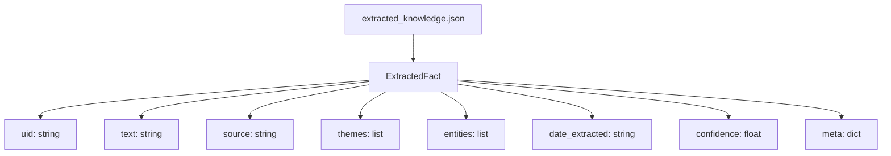
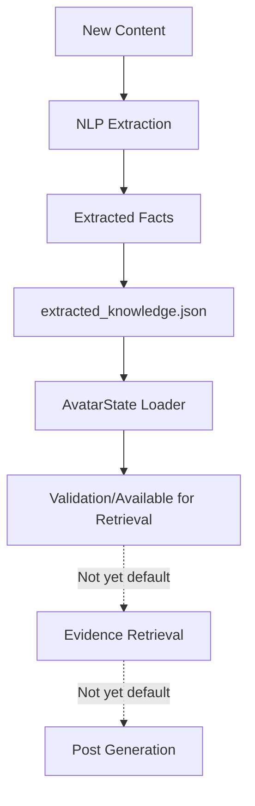

# Feature Idea: Avatar Continual Learning via NLP-Extracted Knowledge Graph

## Overview

Enable the avatar to continually learn from new content by introducing an additional knowledge graph JSON file for NLP-extracted facts, terms, and relationships. This approach leverages the existing modular, file-based architecture and avoids unnecessary complexity.

## Problem Statement

Currently, the avatar's knowledge is limited to static persona and domain knowledge graphs. As new information is encountered (e.g., from RSS feeds or curated articles), there is no automated way to extract and integrate new facts or concepts into the avatar's reasoning and evidence base.

## Proposed Solution

- Add a new structured JSON file (e.g., `data/avatar/extracted_knowledge.json`) to store facts, terms, and relationships extracted by an NLP pipeline.
- Define a new dataclass (e.g., `ExtractedFact`, `ExtractedKnowledgeGraph`) in `services/avatar_intelligence.py` to represent and load this data.
- Implement loader, validator, and normalizer functions for the new graph, mirroring existing patterns.
- Optionally, update retrieval and grounding logic to include these new facts alongside persona and domain evidence.

## extracted_knowledge.json Schema

## Pipeline (Current State)

**Note:** As of now, extracted_knowledge.json is loaded and validated with the avatar state, but is **not yet integrated by default** into evidence retrieval or post generation. Integration is straightforward and planned, but not active in the current pipeline.

## Expected Benefits

- The avatar can accumulate and leverage new knowledge over time, improving relevance and depth.
- No need for a graph database or major refactor—keeps the system simple and maintainable.
- Modular: easy to extend, debug, and test.

## Technical Considerations

- Follows the same file-based, schema-validated approach as persona and domain graphs.
- Loader/normalizer functions can be copy-adapted from existing code.
- Retrieval logic can be extended to include the new fact type with minimal changes.
- No new dependencies or infrastructure required.

## Project System Integration

- `services/avatar_intelligence.py`: Add dataclass, loader, and normalizer for extracted knowledge.
- `data/avatar/extracted_knowledge.json`: New data file for NLP-extracted facts.
- (Optional) Update evidence retrieval and explain output to surface new facts.

## Initial Scope

- Define schema and dataclass for extracted facts.
- Implement loader and normalizer.
- Add new JSON file and document schema.
- (Optional) Integrate into retrieval/grounding if desired.

## Success Criteria

- New facts can be extracted, stored, and loaded without errors.
- Avatar can reference new knowledge in evidence and explain outputs.
- No disruption to existing persona/domain knowledge flows.
- System remains simple, maintainable, and easy to extend.
