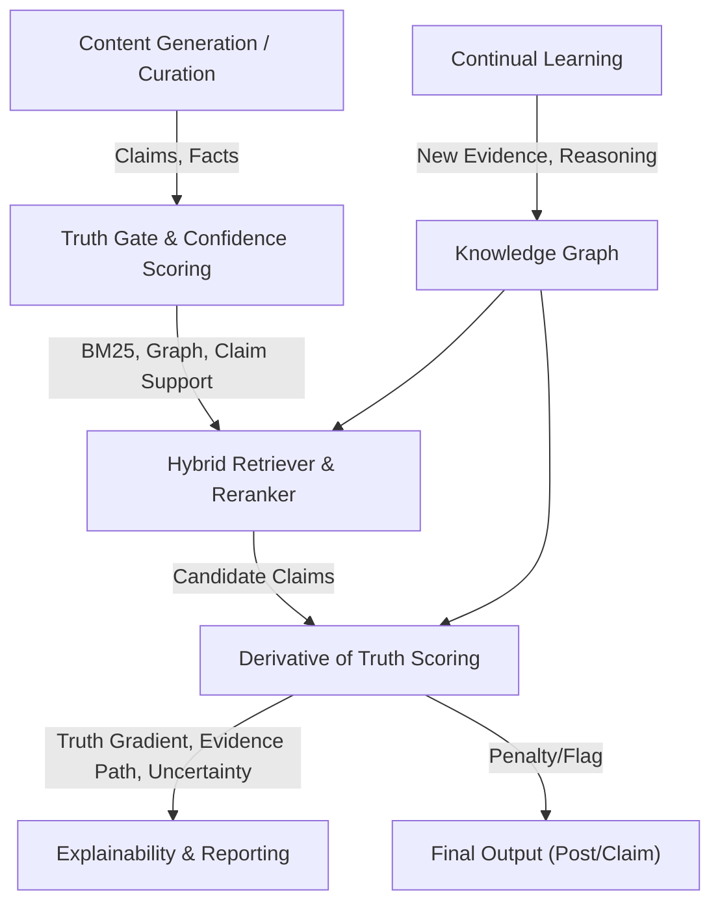
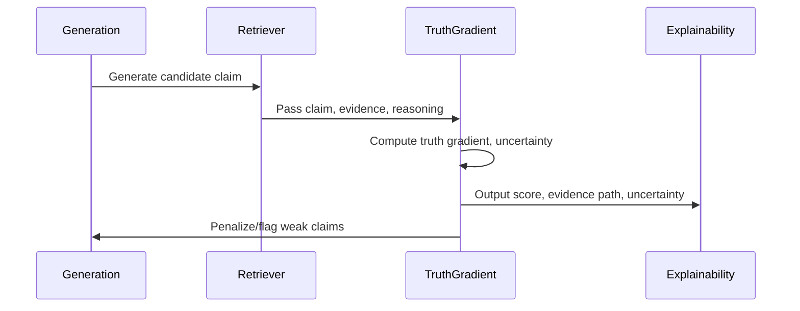
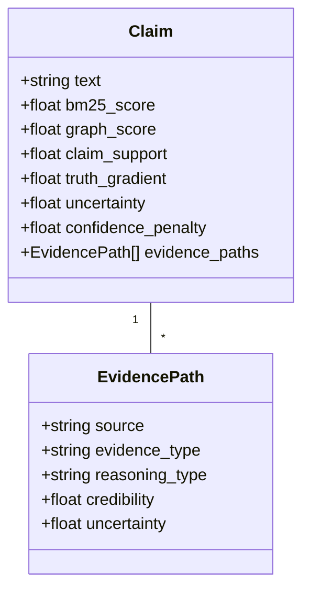

# Technical Design Document: Derivative of Truth Framework

## 1. Architecture Overview

The Derivative of Truth framework augments the existing truth gate and confidence scoring pipeline with a new scoring subsystem that explicitly models evidence strength, reasoning validity, and uncertainty. It introduces a truth gradient metric for every generated claim/post, and integrates with the knowledge graph, hybrid retriever, continual learning, and explainability/reporting subsystems.

## 2. Project System Integration

- **Knowledge Graph:** Annotate facts/claims with evidence type, reasoning type, and uncertainty.
- **Hybrid Retriever:** Passes candidate claims to the truth gradient scorer for reranking and filtering.
- **Truth Gate:** Incorporates truth gradient and uncertainty penalty into final acceptance/rejection.
- **Continual Learning:** New evidence and reasoning paths update knowledge graph annotations.
- **Explainability CLI:** Surfaces truth gradient, evidence path, and uncertainty breakdown for each output.

## 3. Component Design

### 3.1 Truth Gradient Scorer

- **Inputs:** Candidate claim/post, evidence sources, reasoning paths, uncertainty factors
- **Outputs:** Truth gradient score, evidence path, uncertainty score, confidence calibration penalty
- **Algorithm:**
  - For each claim, aggregate all supporting evidence and reasoning paths
  - Compute weighted sum:
    - Evidence strength (primary, secondary, derived, pattern)
    - Reasoning validity (logical, statistical, analogy, pattern)
    - Source credibility (independence, expertise, historical accuracy)
    - Uncertainty penalty (conflicts, long chains, sparse evidence)
  - Calculate truth gradient and confidence calibration penalty

### 3.2 Evidence & Reasoning Annotation

- Extend knowledge graph schema to include:
  - `evidence_type`: primary, secondary, derived, pattern
  - `reasoning_type`: logical, statistical, analogy, pattern
  - `source_credibility`: numeric weight
  - `uncertainty`: numeric penalty
- Update learning pipeline to annotate new facts/claims

### 3.3 CLI & Reporting

- Show truth gradient, evidence path, and uncertainty for each claim/post
- Flag overconfident or weakly supported claims
- Allow user to inspect evidence/reasoning breakdown

## 4. Data Model

## 5. API Design

- `score_claim_with_truth_gradient(claim, evidence_paths) -> TruthGradientResult`
- `annotate_evidence_and_reasoning(fact) -> AnnotatedFact`
- `report_truth_gradient(claim) -> dict`

## 6. Integration Points

- Knowledge graph (NetworkX/Neo4j)
- Hybrid retriever
- Truth gate
- Continual learning
- Explainability CLI

## 7. Security Considerations

- No sensitive data is exposed in evidence paths
- All scoring and reporting is local

## 8. Performance Considerations

- Truth gradient computation is vectorized and cached where possible
- Fallback to current scoring if annotations are missing

## 9. Error Handling

- If evidence or reasoning annotations are missing, fallback to BM25+graph scoring
- All scoring functions must handle missing or malformed data gracefully

---

**References:**

- [prd.md](./prd.md)
- [idea.md](./idea.md)
- "The Derivative of Truth: A New Mathematical Framework for AI Truthfulness"
- [docs/features/continual-learning/idea.md](../continual-learning/idea.md)
