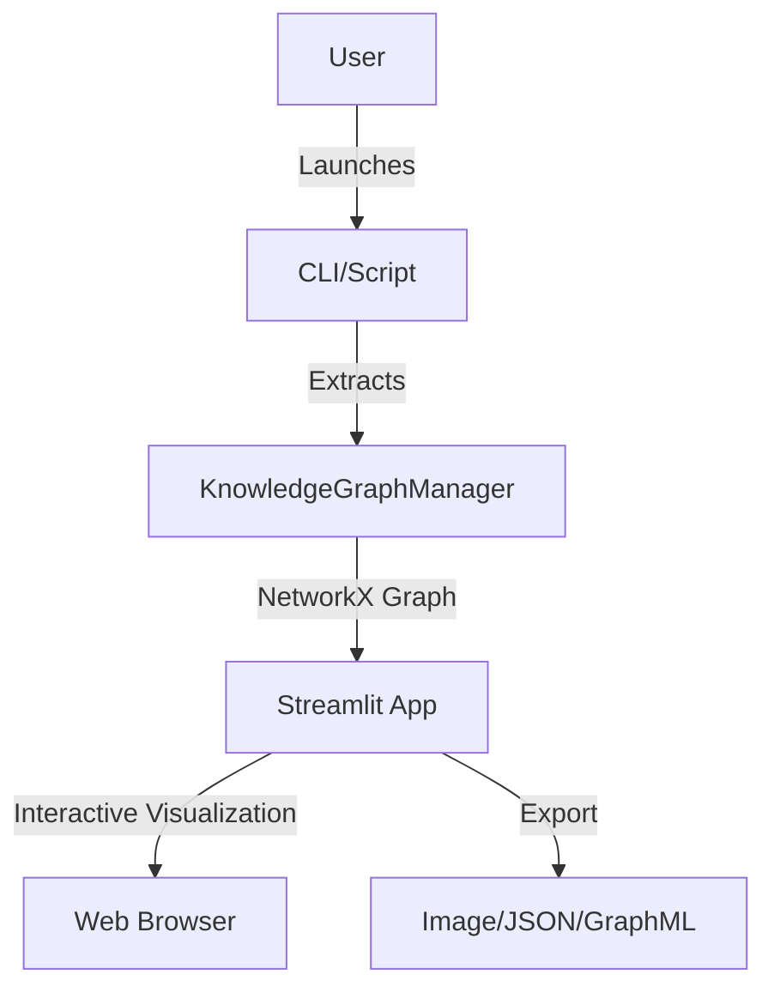
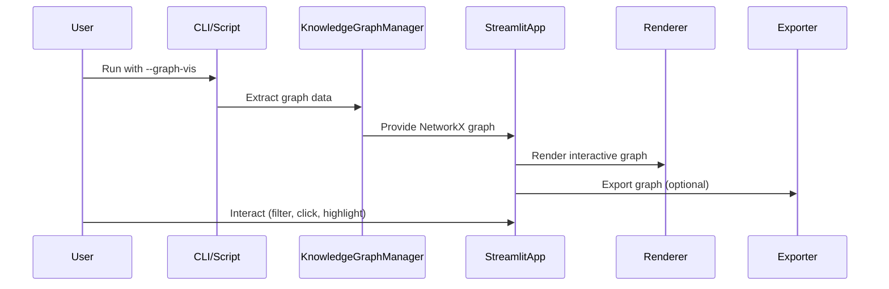
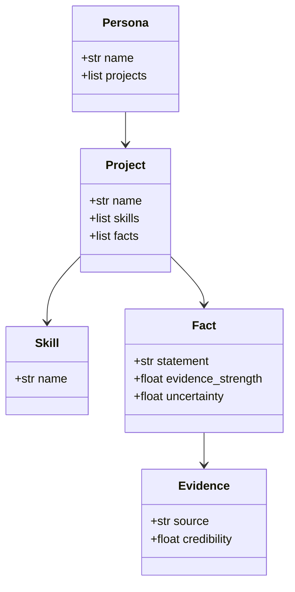

# Technical Design Document: Knowledge Graph Visualization (Streamlit)

## 1. Architecture Overview

The Knowledge Graph Visualization feature provides an interactive, local-first UI for exploring the persona, projects, and learned facts graph. The UI is implemented in Streamlit, leveraging NetworkX for graph data and PyVis/Plotly for rendering.

### Mermaid Diagram: High-Level Architecture

## 2. Component Design

### Components

- **KnowledgeGraphManager**: Extracts persona, projects, facts, and evidence as a NetworkX graph.
- **Streamlit App**: Main UI, renders the graph, provides controls for filtering, highlighting, and export.
- **PyVis/Plotly Renderer**: Renders the NetworkX graph as an interactive visualization.
- **Exporter**: Handles export to image, JSON, or GraphML.
- **CLI Integration**: Launches the Streamlit app via `--graph-vis` flag or standalone script.

### Mermaid Diagram: Component Interaction

## 3. Data Model

- **Nodes**: Persona, Project, Skill, Fact, Evidence
- **Edges**: Relationships (persona→project, project→fact, fact→evidence, etc.)
- **Attributes**: Node type, evidence strength, uncertainty, details

### Mermaid Diagram: Data Model (Class Diagram)

## 4. API Design

- No external API; all data is local.
- Streamlit app loads data from KnowledgeGraphManager (in-memory or file).
- Export endpoints: Save as image, JSON, or GraphML.

## 5. Integration Points

- **main.py**: Add `--graph-vis` flag to launch Streamlit app.
- **KnowledgeGraphManager**: Provides graph extraction and serialization.
- **Exporter**: Handles export logic.

## 6. Security Considerations

- All data stays local; no uploads or external calls.
- Exports are user-initiated and saved locally.
- No private data is exposed in UI or exports.

## 7. Performance Considerations

- Efficient extraction from KnowledgeGraphManager (target <1s for graphs <2,000 nodes).
- Use PyVis/Plotly for fast, interactive rendering.
- Streamlit app loads and renders in under 2 seconds for typical graphs.

## 8. Error Handling

- Graceful fallback if graph is empty or missing data.
- User-friendly error messages in UI.

---

This design ensures a robust, user-friendly, and secure knowledge graph visualization experience, tightly integrated with the existing system and easily extensible for future needs.
