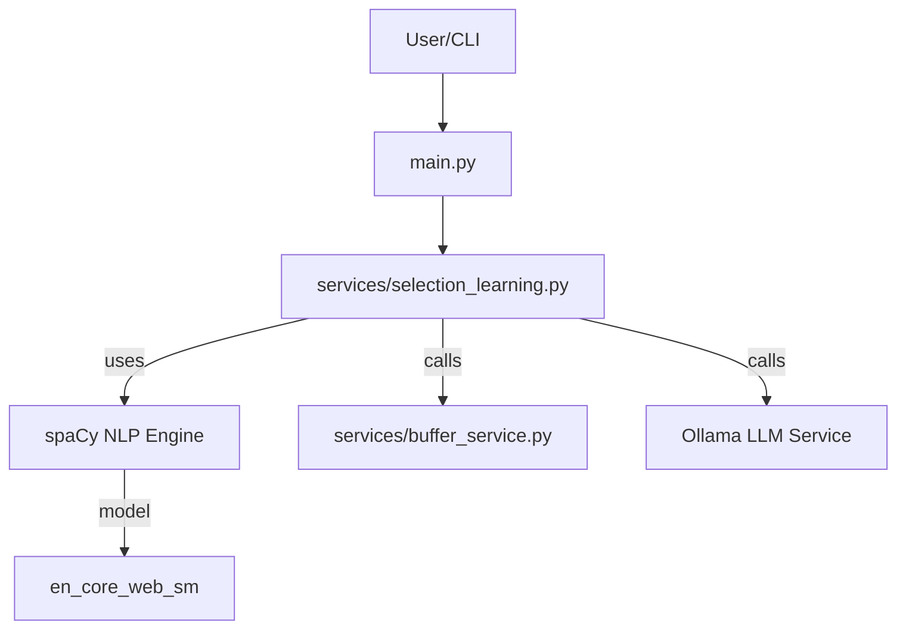
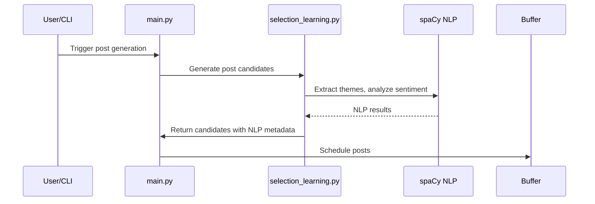

# Technical Design Document: spaCy NLP Enhancement

## 1. Architecture Overview

This enhancement integrates spaCy into the LinkedIn SSI Booster pipeline to provide advanced NLP for theme/claim extraction, semantic similarity, and content analysis. The design ensures modularity, testability, and minimal disruption to existing workflows.



## 2. Project System Integration

- **Narrative memory:** spaCy replaces/augments theme/claim extraction in `services/selection_learning.py`.
- **Repetition penalty:** spaCy vectors used for semantic similarity.
- **Content curation:** Sentiment/tone analysis for moderation/reporting.
- **Prompt generation:** Detected entities/topics inform prompt templates.
- **Testing:** spaCy logic is mockable; dry-run mode skips model download.

## 3. Component Design

### a. spaCy NLP Engine

- **Responsibility:** Provide NER, noun chunking, dependency parsing, vector similarity, sentiment/tone analysis.
- **Interfaces:**
  - `extract_themes(text: str) -> List[str]`
  - `compute_similarity(text1: str, text2: str) -> float`
  - `analyze_sentiment(text: str) -> Dict[str, Any]`
- **Dependencies:** spaCy, en_core_web_sm

### b. Selection Learning Module

- **Responsibility:** Orchestrate theme/claim extraction, repetition penalty, and content analysis.
- **Interfaces:**
  - Calls spaCy NLP Engine for all NLP tasks
  - Integrates with Buffer and Ollama services
- **Dependencies:** spaCy NLP Engine, buffer_service, ollama_service

### c. Buffer/Ollama Services

- **Responsibility:**
  - Buffer: Scheduling and external API calls for post publishing
  - Ollama: Local LLM for post generation and prompt completion
- **Interfaces:** Unchanged for Buffer; Ollama called via local API/module

## 4. Data Model

- No new persistent data models; all NLP results are transient and attached to post/candidate objects in memory.
- Example structure:
  ```python
  class PostCandidate:
      text: str
      themes: List[str]
      sentiment: Dict[str, Any]
      similarity_score: float
  ```

## 5. API Design

- All NLP logic is internal; no new external API endpoints.
- Exposed via Python interfaces in `services/selection_learning.py`.

## 6. Integration Points

- `services/selection_learning.py`: All spaCy logic is encapsulated here or in a helper module.
- `requirements.txt`: Add spaCy and model install instructions.
- `tests/test_selection_learning.py`: Unit tests for all new logic (mock spaCy in CI).

## 7. Security Considerations

- All NLP is local; no data leaves the host.
- No new secrets or API keys required.

## 8. Performance Considerations

- Model loaded once per process.
- NLP analysis must not add >1s per post (test with en_core_web_sm).
- Dry-run mode disables heavy NLP.

## 9. Error Handling

- Catch and log spaCy exceptions; fallback to basic extraction if spaCy unavailable.
- Unit tests cover all error paths.

## 10. Mermaid Sequence Diagram: Post Processing



## Implementation Progress

### Phase 1: Core NLP Features (Completed)

- [x] Add spaCy dependencies to requirements.txt
- [x] Create spaCy NLP service module (services/spacy_nlp.py)
  - [x] Implement SpacyNLP class with model loading
  - [x] Add extract_themes() method (NER + noun chunks)
  - [x] Add compute_similarity() method (vector similarity)
  - [x] Add analyze_sentiment() method (sentiment analysis)
  - [x] Add error handling and fallbacks
- [x] Integrate spaCy into selection_learning.py
  - [x] Import and initialize SpacyNLP
  - [x] Use theme extraction in candidate processing
  - [x] Use similarity for repetition penalty
  - [x] Add sentiment analysis to PostCandidate data
- [x] Add unit tests
  - [x] Test theme extraction
  - [x] Test similarity computation
  - [x] Test sentiment analysis
  - [x] Test error handling and fallbacks
  - [x] Mock spaCy in tests for CI
- [x] Documentation and verification
  - [x] Add model installation instructions to README
  - [x] Run syntax checks

### Phase 2: Enhanced Grounding & Curation (In Progress)

- [ ] Fact Suggestion for Truth Gate
  - [ ] Add suggest_matching_facts() method to SpacyNLP
  - [ ] Integrate with console_grounding.py truth gate
  - [ ] Add interactive mode suggestions
  - [ ] Test fact suggestion accuracy
- [ ] Contextual Article Summarization
  - [ ] Add summarize_article() method to SpacyNLP
  - [ ] Integrate with content_curator.py
  - [ ] Use summaries for better commentary generation
  - [ ] Test summarization quality
- [ ] Final verification
  - [ ] Update tests for new features
  - [ ] Run full test suite
  - [ ] Update documentation
