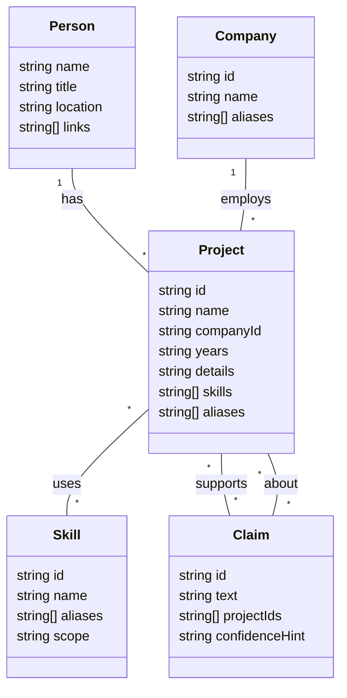
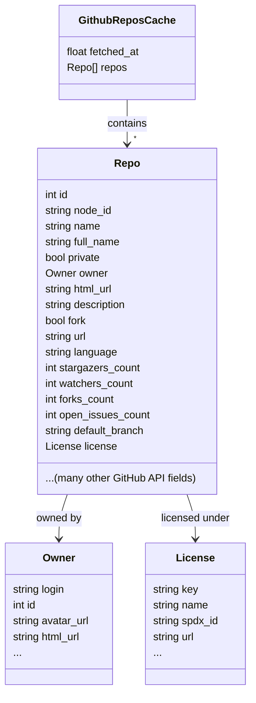
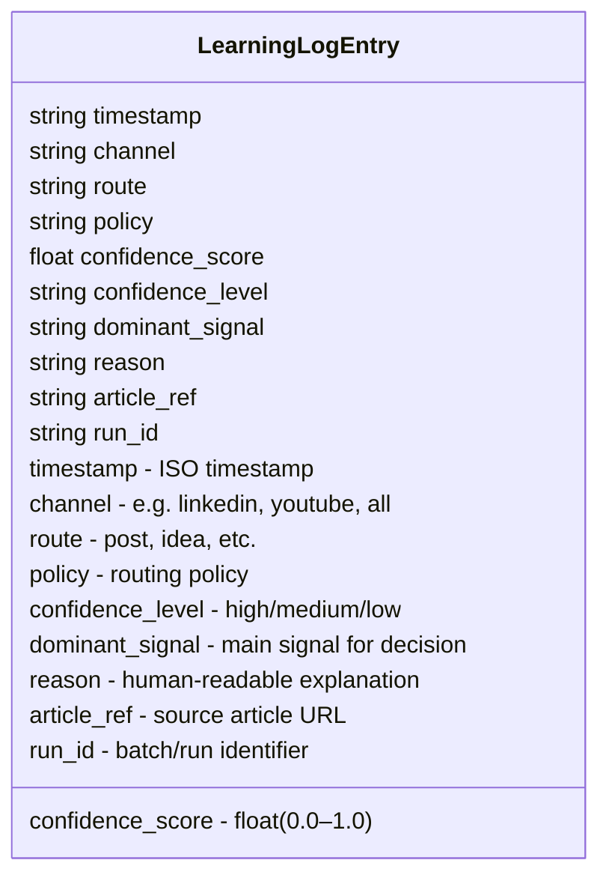
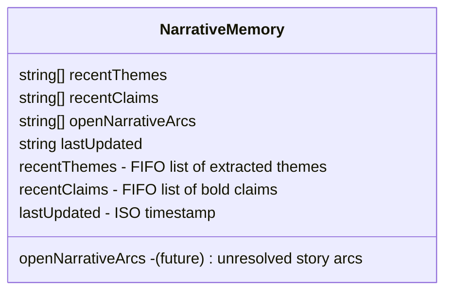

# Persona and Avatar Intelligence

This guide covers how the project personalizes output to the user and how the optional Avatar Intelligence overlays help explain, score, and diversify generated content. Personalization is built from a persona graph, a persistent system prompt, writing rules, content angles, and local memory.

## Persona graph

The primary identity source is `data/avatar/persona_graph.json`, which stores name, role, location, companies, skills, projects, and verifiable claims in structured JSON. At startup, `load_avatar_state()` converts this graph into ranked `EvidenceFact` objects used for grounding, retrieval, and persona chat.

Below is a visual schema of the persona graph (see `data/avatar/persona_graph.json`):

If your Markdown viewer does not support Mermaid, see the schema fields above or refer to the example JSON for structure.

The persona graph can also be enriched with live GitHub data through `services/github_service.py`, including repository metadata and compact README summaries. The README notes cached metadata in `github_repos_cache.json` and README summaries in `github_readmes_cache.json` with a 24-hour TTL.

Below is a class diagram of the GitHub repos cache structure (`github_repos_cache.json`):

If your Markdown viewer does not support Mermaid, see the schema fields above or refer to the example JSON for structure.

## Persona system prompt

`PERSONA_SYSTEM_PROMPT` is loaded into every AI call and carries identity anchors, voice guidance, audience framing, forbidden phrases, and a technical glossary. The documentation says AI projects from 2024 onward are domain-separated from older infrastructure work, with an explicit rule against blending those timelines.

The glossary is also a control mechanism: the model is told never to expand abbreviations that are not present in the approved glossary, which is meant to reduce hallucinated expansions such as incorrect RAG definitions.

## Writing rules

Per-pillar writing rules are configurable in `.env` through `SSI_ESTABLISH_BRAND`, `SSI_FIND_RIGHT_PEOPLE`, `SSI_ENGAGE_WITH_INSIGHTS`, and `SSI_BUILD_RELATIONSHIPS`, while defaults live in `services/shared.py`. The built-in rules include never starting with “I,” avoiding filler phrases, using short punchy paragraphs instead of bullets, and leading with a hook in the first line.

The README frames these rules as drawing on Neuro-Linguistic Programming ideas such as pattern interrupts, presupposition, and anchoring, while also referencing `docs/nlp-basics.md` for the repo’s communication primer.

## Per-post angle

Every topic in `content_calendar.py` carries both a unique `angle` and an `ssi_component`. The angle prevents generic rehash content, while the SSI mapping ensures that scheduled output rotates through all four Social Selling Index pillars over time.

## Explain mode

`--avatar-explain` adds transparency to scheduling and curation runs by showing which evidence IDs were retrieved, how facts scored, and which claim tokens were evaluated by the truth gate. The README positions this as the main diagnostic tool when a post feels weakly grounded or uses the wrong project context.

## Learning report

`--avatar-learn-report` reads moderation decisions from `data/avatar/learning_log.jsonl` and aggregates reason-code frequencies, common removals, and advisory recommendations. The documentation explicitly states that this report is read-only and does not modify the persona graph or configuration files.

Below is a class diagram of the learning log entry structure (`data/avatar/learning_log.jsonl`):

If your Markdown viewer does not support Mermaid, see the schema fields above or refer to the example JSONL for structure.

## Confidence policy

Curated posts receive a confidence score based on truth-gate signal, grounding quality, and narrative repetition. The routing policy can then be set to `strict`, `balanced`, or `draft-first`, controlling whether high-, medium-, or low-confidence outputs are scheduled, sent to Ideas, or blocked.

| Policy        | High confidence | Medium confidence | Low confidence |
| ------------- | --------------- | ----------------- | -------------- |
| `strict`      | Scheduled post  | Ideas board       | Blocked        |
| `balanced`    | Scheduled post  | Scheduled post    | Ideas board    |
| `draft-first` | Ideas board     | Ideas board       | Ideas board    |

## Narrative memory

The local memory file `data/avatar/narrative_memory.json` stores extracted themes and bold-assertion claims from generated posts. These memory items are FIFO-trimmed to `AVATAR_MAX_MEMORY_ITEMS`, and the most recent items feed back into prompts as continuity hints while also contributing to a repetition penalty in confidence scoring.

The intended effect is to discourage repetitive framing across weeks, so recurring messages like the same RAG thesis gradually shift from direct scheduling toward draft review under the policy system.

Below is a class diagram of the narrative memory structure (`data/avatar/narrative_memory.json`):

If your Markdown viewer does not support Mermaid, see the schema fields above or refer to the example JSON for structure.
