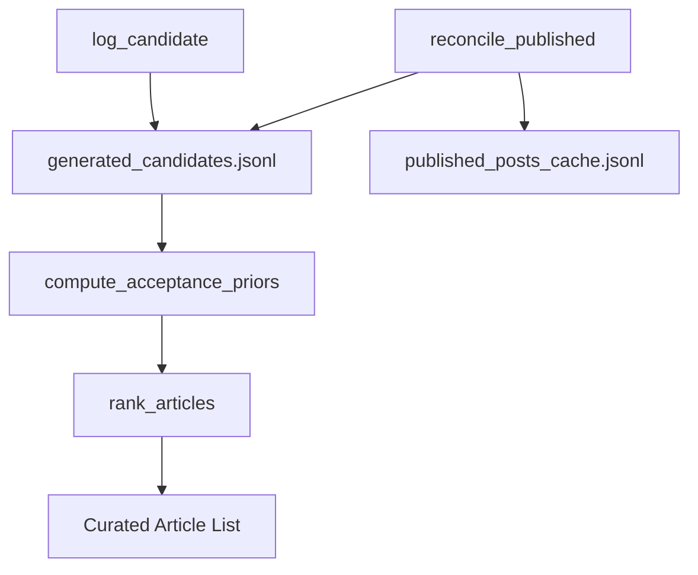

# Selection Learning Engine

This module manages candidate logging, Buffer publish reconciliation, acceptance-prior computation, and adaptive article ranking for the LinkedIn SSI Booster. It enables the system to learn from user selection behavior and optimize future article curation.

---

## High-Level Architecture

---

## Key Components

### 1. Candidate Logging

- `log_candidate()`: Appends each generated post candidate to a JSONL log with metadata and hashes for matching.
- `update_candidate_buffer_id()`: Updates Buffer post IDs after publish.

### 2. Buffer Publish Reconciliation

- `reconcile_published()`: Fetches SENT posts from Buffer, upserts them into a published cache, and matches them to candidates using buffer_id, URL, or Jaccard similarity.
- Labels candidates as selected (True/False) based on match and acceptance window.

### 3. Acceptance Priors

- `compute_acceptance_priors()`: Computes Beta-smoothed acceptance rates for each (source, ssi_component) bucket, learning which sources/topics are most often selected.
- `get_acceptance_rate()`: Looks up acceptance rates for ranking.

### 4. Article Ranking

- `rank_articles()`: Scores and sorts RSS articles using a weighted blend of relevance (keyword match), freshness (recency), and acceptance prior (learned user preference).
- Formula:  
  $score = (1-\alpha) \times (0.5 \times relevance + 0.5 \times freshness) + \alpha \times acceptance\_rate$
- Ensures high-performing sources/topics float to the top over time.

---

## File: services/selection_learning.py

- All logic described above is implemented in this file.
- Entry points: `log_candidate()`, `reconcile_published()`, `compute_acceptance_priors()`, `rank_articles()`.

---

For further details, see the code and docstrings in [services/selection_learning.py](../services/selection_learning.py).
